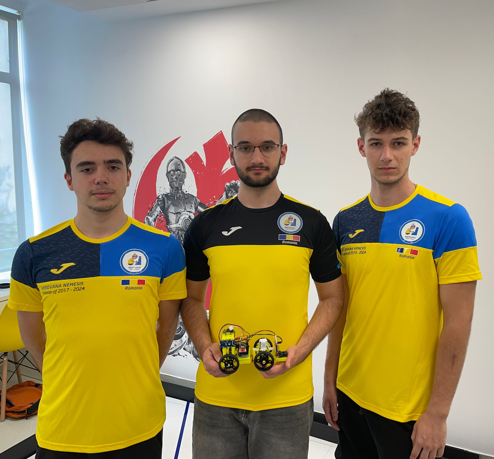
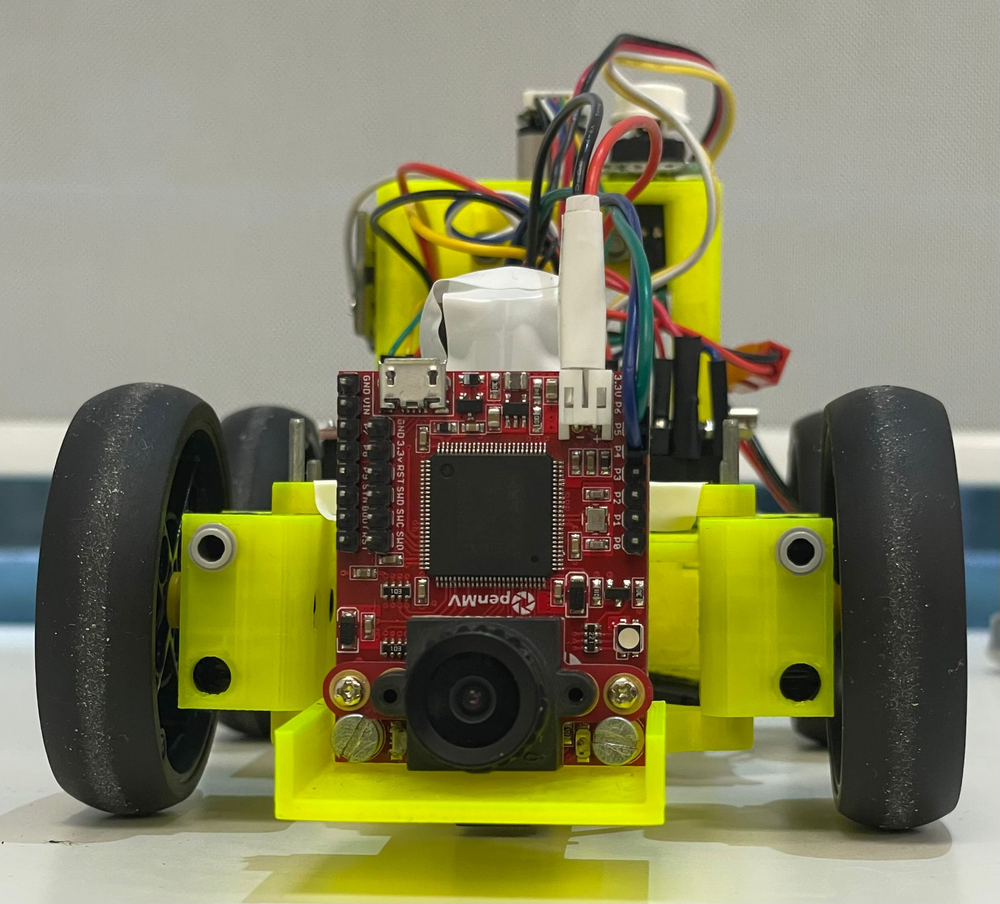
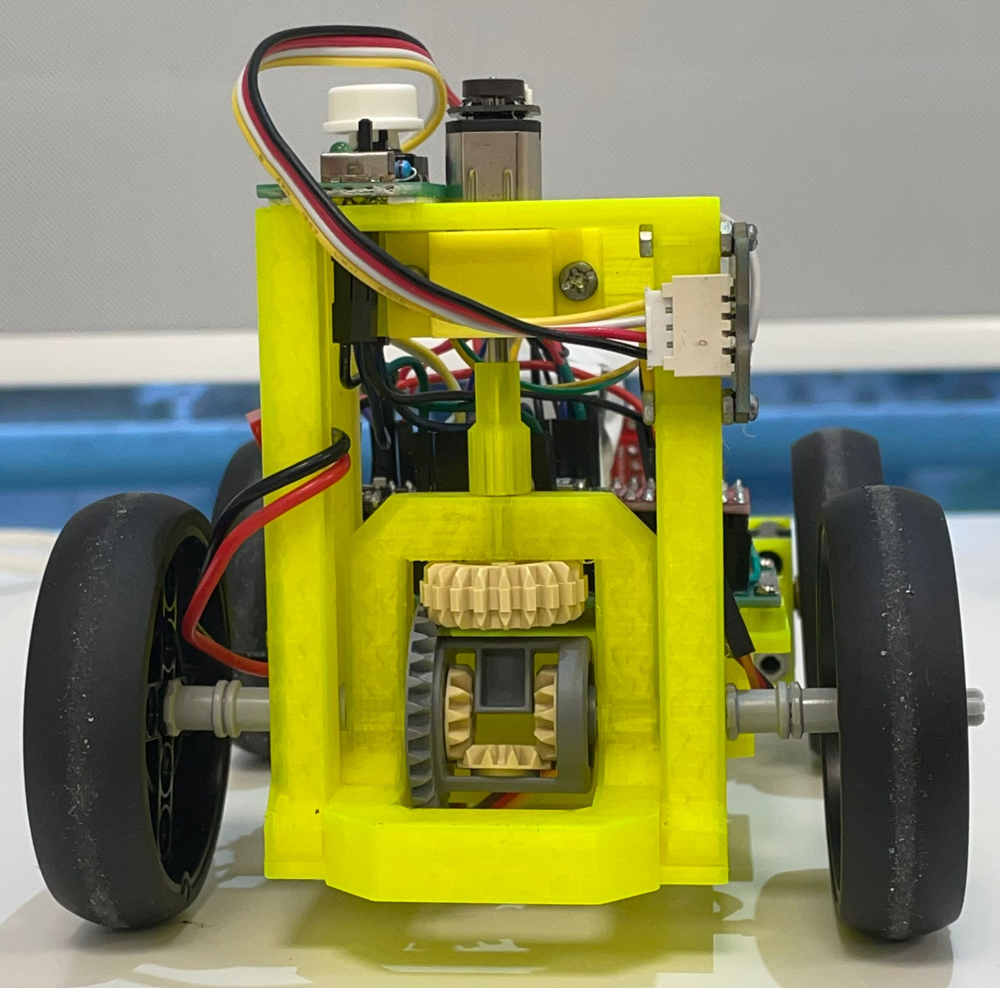
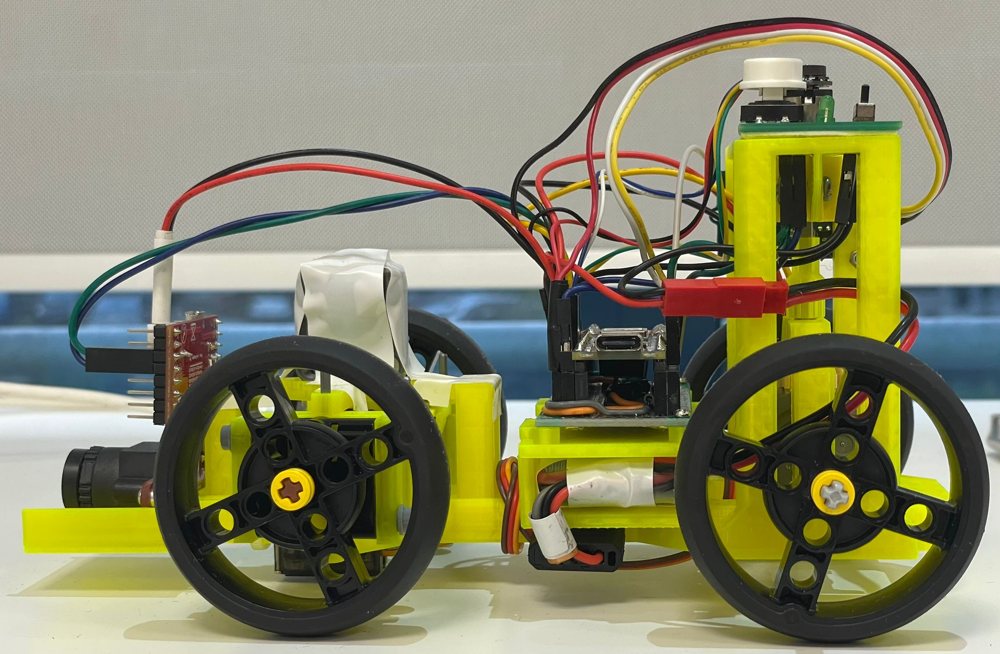
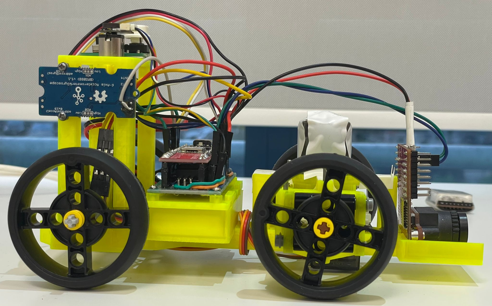
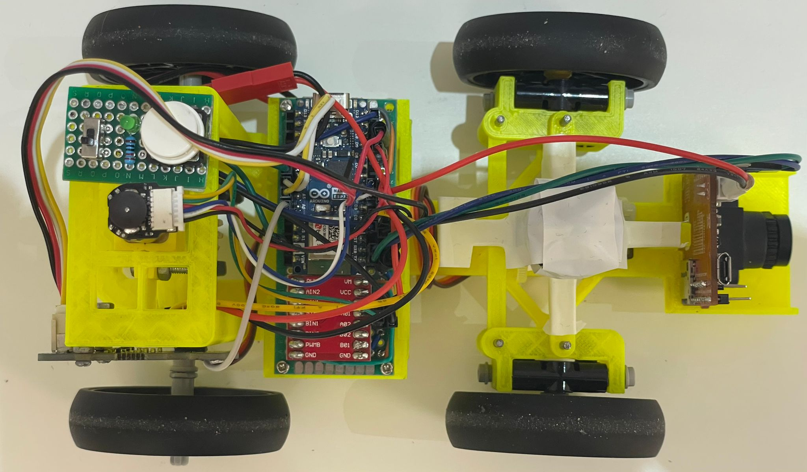
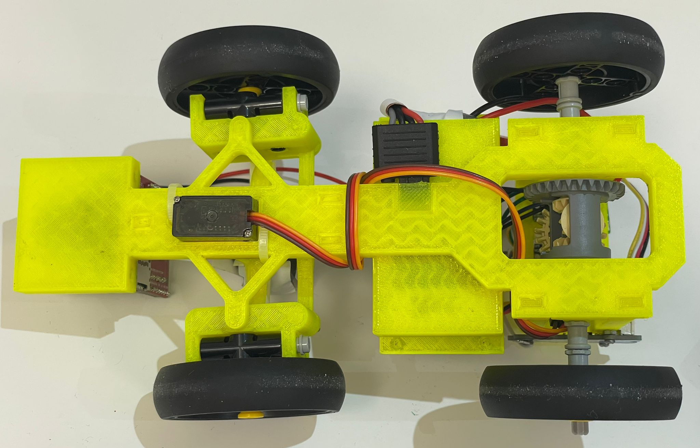

<center><h1> Nerdvana Cancer 2024 </center>

## Table of Contents
* [Photos](#team-image)
  * [Team](#team-image)
  * [Robot](#robot-image)
* [Performance Video](#video)
* [Mobility Management](#mobility-management)
  * [Powertrain](#powertrain-mechanical)
    * [Drivetrain](#drivetrain-mechanical)
    * [Motor](#motor-mechanical)
    * [Motor Driver](#motor-driver-mechanical)
  * [Steering](#steering-mechanical)
    * [Servo Motor](#servo-motor)
  * [Chassis](#chassis-mechanical)
* [Power and Sense Management](#power-and-sense-management)
  * [Li-Po Battery](#li-po-battery)
  * [Arduino Nano ESP32](#arduino-nano-esp32)
  * [IMU](#imu-sensor)
  * [OpenMV Cam H7 R2](#openmv-cam-h7-r2)
  * [Voltage Regulator](#voltage-regulator)
  * [Circuit Diagram](#circuit-diagram)
* [Code for each component](#code-for-each-component)
  * [Drive Motor](#drive-motor-code)
  * [Servo Motor](#servo-motor-code)
  * [Camera](#camera-code)
  * [IMU](#gyro-sensor-code)
* [Obstacle Management](#obstacle-management)
  * [Qualification Round](#quali-management)
  * [Final Round](#final-management)
* [Randomizer](#randomizer)
* [Resources](#resources)
  * [3D Models](#3d-models-resources)
  * [Images](#images-resources)

### Team: Priboi Mihai, Nicola Victor, Bălan Teodor <a class="anchor" id="team-image"></a>
  

## Photos of our robot <b>TBD<b> <a class="anchor" id="robot-image"></a>

|  |  | 
| :--: | :--: | 
| *Front* | *Back* |
|  |  | 
| *Left* | *Right* |
|  |  | 
| *Top* | *Bottom* |

<br>

## Our video of the robot on [Youtube](https://youtu.be/C5bkap5dbnA) <a class="anchor" id="video"></a>

<br>

# Mobility Management <a class="anchor" id="mobility-management"></a>
<!--  -->

## Powertrain <a class="anchor" id="powertrain-mechanical"></a>

<!--  -->

### Drivetrain <a class="anchor" id="drivetrain-mechanical"></a>

To minimize friction and thereby reduce speed loss, driving axle was made from lego pieces. We conected the motor to the driving axle using a custom 3D-printed adapter. The driving axle has a rear wheel lego differential, which allows the robot to turn smoothly. As the axle was already lego, we used lego wheels.

### Motor <a class="anchor" id="motor-mechanical"></a>


Following an evaluation of different motors, we settled on a micro DC gear motor on which we attached a magnetic encoder. This motor was selected for its lightweight and compact design, which stands out among others with comparable output. Additionally, the magnetic encoder offers greater precision than its optical counterpart. We secured the motor to the chassis using a custom 3D-printed holder.

**Specifications:**
- Voltage: 12V
- Gear Ratio: 1:50
- Speed: 650 ± 31% rpm
- Torque: 0.67 ± kg·cm
- Weight: 9.5g

Where to buy the motor: https://www.pololu.com/product/3039

To connect the motor's axle to a Lego-compatible axle, we created a custom 3D-printed adapter.


To secure the motor to the chassis, we designed a custom 3D-printed holder. The holder is split into two halves, which are then screwed together to ensure the motor remains in place.

 3D piece")

### Motor Driver <a class="anchor" id="motor-driver-mechanical"></a>


To control the speed of the drive motor, we utilized a SparkFun Dual TB6612FNG motor driver.

Where to buy the motor driver: https://www.sparkfun.com/products/14450

<br>

**Potential Improvements:**

The current motor driver, which has the capacity for two motors but is only using one, can be replaced with a custom-made PCB. This modification aims to reduce the robot's overall weight and size, thereby enhancing its efficiency and performance.

## Steering <a class="anchor" id="steering-mechanical"></a>

<!--  -->

After experimenting with various steering mechanisms such as Ackermann steering and bell-crank steering, we assessed their advantages and drawbacks. Ultimately, we chose a straightforward steering system consisting of a parallelogram linkage. This decision was made because the alternative systems were either too large or too complex to implement effectively. Our selected mechanism is simple, light, and compact, providing a satisfactory steering angle. While it does not adhere to the Ackermann steering geometry, our tests showed that for our robot's small size and light weight, this omission was not critically significant.

As an upgrade to last year's design, we replaced the Lego-based steering system with a custom 3D-printed one. This change allowed us to reduce the robot's weight and size, while also enhancing its overall performance. The new steering system is more robust and offers greater flexibility in terms of design and implementation.

The steering system is composed of 2 symmetrical wheel holders, that are conected togheter by a steering arm. The steering arm is conected to the servo motor. The joints between the wheel holders and the steering arm are made using steel rods.


### Servo Motor <a class="anchor" id="servo-motor"></a>


For steering, we selected the MG90S servo motor, favoring it for its high torque and swift response.

**Specifications:**
- Weight: 13.4g
- Stall torque: 2.2 kgf·cm (6V)
- Operating speed: 0.08 s/60 degree (6V)
- Rotation angle: 120 degree

Where to buy the servo motor: https://cleste.ro/motor-servo-mg90s-180g.html

## Chassis <a class="anchor" id="chassis-mechanical"></a>

Our previous attempts at designing a robot for the Future Engineers category were bulky and heavy, mostly lego based. This year, we aimed to create a more compact and lightweight robot. We achieved this by using a almost entirely 3D-printed chassis. Because of this, the fact that we tried to use as few components as possible, the robot is aproximately 50% lighter than last year's robot, while also being more compact.

Another improvement we made was the way of connecting 3d pars togheter. Instead of using lego or screws, we used snapping joints and pins.

The chassis holds basically all of the components. Only the gearmotor and the gyroscope are attached to a separate piece that is then attached to the chassis. The back holds the differential; the middle part has a hole for the battery, on top of which the pcb is mounted using a 3d printed holder. The front holds the camera and the servo motor; the servo mount piece is attached to the chassis as well.


The motor support is a separate piece that holds the motor and the gyroscope. It is attached to the chassis using snapping joints.


# Power and Sense Management <a class="anchor" id="power-and-sense-management"></a>

### Li-Po Battery <a class="anchor" id="li-po-battery"></a>


Where to buy the battery: https://hpi-racing.ro/li-po-2s-74v/acumulator-lipo-gens-ace-g-tech-soaring-450mah-74v-30c-2s1p-cu-jst-syp.html

The battery is mounted using a custom 3D-printed holder, which is secured to the chassis.

<!--  -->

### Arduino Nano ESP32 <a class="anchor" id="arduino-nano-esp32"></a>


At previous competitions, we used many microcontrollers to manage the robot's various components. This year, we opted for the Arduino Nano ESP32, which combines the functionalities of an Arduino Nano and an ESP32. This microcontroller is capable of handling all of the robot's sensors and actuators, providing a more streamlined and efficient solution.

Where to buy the Arduino Nano ESP32: https://store.arduino.cc/products/nano-esp32

The Arduino, mounted on a prototype board, is secured to the chassis with a 3D-printed holder. The pcb is attached to the chassis using screws.


### IMU <a class="anchor" id="imu-sensor"></a>


One importat aspect that helps the roboy navigate is the inertial measurement unit (IMU). This sensor is based on BOSCH BMI088, which is a high-performance IMU with high vibration suppression. While the IMU measure the angular velocity and the acceleration of the robot, we only use the angular velocity to calculate the angle of the robot. The IMU is wired to the SDA and SCL pins on the arduino.

**Specifications:**
- Gyroscope range: ±2000°/s
- Accelerometer range: ±24g

Where to buy the gyro sensor: https://www.seeedstudio.com/Grove-6-Axis-Accelerometer-Gyroscope-BMI088.html

### OpenMV Cam H7 R2 <a class="anchor" id="openmv-cam-h7-r2"></a>


The OpenMV Cam H7 R2 is a high-performance camera capable of color tracking. The best feature of this camera compared to other options (like the Pixy cam) is that is has a built-in microcontroller that can process the images and send the results to the Arduino. This way, the Arduino can focus on the robot's movement and the camera can focus on the image processing.

Together with the Arduino Nano ESP32, the camera delivers readings at approximately 60 frames per second.

Where to buy the OpenMV Cam H7 R2: https://openmv.io/products/openmv-cam-h7-r2

### Voltage regulator <a class="anchor" id="voltage-regulator"></a>
")

To provide the Arduino Nano ESP32 with the required 5V, we needed to decrease the output from the 7.4V battery, which can reach up to 8.4V when fully charged. We employed a linear voltage regulator, the L7805CV, capable of converting input voltages below 35V down to a steady 5V.

Where to buy the 5V voltage regulator: https://ro.mouser.com/ProductDetail/STMicroelectronics/L7805CV?qs=9NrABl3fj%2FqplZAHiYUxWg%3D%3D

### PCB design <a class="anchor" id="pcb"></a>

The PCB was made on a prototype board. The board has a voltage regulator, the Arduino Nano ESP32, the motor driver, and connectors for the motor, the servo motor, the IMU, and the camera. The board is powered by the LiPo battery.

| PCB connections | PCB w/ regulator | PCB complete |
| :--: | :--: | :--: |
|  |  |  |


### Circuit diagram <a class="anchor" id="circuit-diagram"></a>


<br>

# Code for each component <a class="anchor" id="code-for-each-component"></a>

## Drive Motor <a class="anchor" id="drive-motor-code"></a>

The motor driver can be directly managed with a single PWM pin that adjusts the motor's speed and two digital pins designated for determining the motor's rotation direction. Consequently, the use of any external library for motor manipulation was unnecessary.

We devised two functions within our control system: one to modify the motor's velocity and another to halt it effectively, incorporating a braking feature. To achieve this, we convert the desired speed from our established scale of -100 to +100 to the PWM equivalent of 0 to 1023. The motor's direction is then adjusted according to the sign of the input value.

Given the fact that the Arduino has an ESP chip, the PWM signals have to be sent using the ledc utility.

```ino
void motor_driver_setup() {
  ledcSetup(DRIVER_PWM_CHANNEL, PWM_FREQ, PWM_RES);
  ledcAttachPin(PWMA, DRIVER_PWM_CHANNEL);
  pinMode(AIN1, OUTPUT);
  pinMode(AIN2, OUTPUT);
}

void move_motor(double speed) {
  int dir = 1;
  if (speed < 0) {
    dir = -1;
    speed *= -1;
  }
  else if (speed == 0) {
    dir = 0;
  }
  speed = map_double(speed, 0, 100, 0, 1023);
  if (dir == 1) {
    digitalWrite(AIN1, HIGH);
    digitalWrite(AIN2, LOW);
  }
  else if (dir == -1) {
    digitalWrite(AIN1, LOW);
    digitalWrite(AIN2, HIGH);
  }
  else {
    digitalWrite(AIN1, LOW);
    digitalWrite(AIN2, LOW);
  }
  ledcWrite(DRIVER_PWM_CHANNEL, (int)speed);
}

void motor_break() {
  move_motor(-5);
}
```

However, for the encoder, we required a specialized library to handle the more complex signal processing. The library we use for interfacing with the encoder is called _Encoder.h_.

The encoder operates with a straightforward function that we found easy to comprehend and program. In order to determine the distance in cm, we divided the returned value by 12, since the encoder measures 12 counts per revolution. Then we multiplied this with the gear ratio, wheel diameter and pi. After that we divied by 10 to convert to cm.

```ino
double read_motor_cm(double wheel_diameter, double gear_ratio) {
  return gear_ratio * wheel_diameter * M_PI * (double)myEnc.read() / 12 / 10;
}
```

## Servo Motor <a class="anchor" id="servo-motor-code"></a>

For controlling the servo motor, we utilize the _Servo.h_ library, which provides the necessary functions to manage the servo's movements. Initially, we configure the servo by establishing its range, defining the maximum and minimum angles it can achieve in both directions. This ensures that we can accurately position the servo within its operational limits.

```ino
void servo_setup() {
  servo.attach(SERVO_PIN);
  for (int deg = servo.read() - 1; deg >= ANGLE_MIN; deg--)
    servo.write(deg);
  delay(500);
  Serial.println("after ANGLE_MIN");
  for (int deg = servo.read() + 1; deg <= ANGLE_MID; deg++)
    servo.write(deg);
  delay(500);
  Serial.println("after ANGLE_MID");
  for (int deg = servo.read() + 1; deg <= ANGLE_MAX; deg++)
    servo.write(deg);
  delay(500);
  Serial.println("after ANGLE_MAX");
  for (int deg = servo.read() - 1; deg >= ANGLE_MID; deg--)
    servo.write(deg);
  delay(500);
  Serial.println("after ANGLE_MID");
  goal_deg = ANGLE_MID;
}
```

The servo motor is controlled dinamically in the loop by setting a goal angle and taking small steps towards that goal at every iteration. This way we make sure that we can send a lot of fast angle changes to the servo and get the wanted results.

The function _move_servo_ sets the goal angle to the given parameter angle. If the angle is negative the motor will rotate to the right, and if it is positive, the motor will rotate to left. This way, 0 is going to be the position in which the wheels are straight. Also, the values we are giving the motor need to be between -1 and 1, so we use a clamp function to limit the value we are going to give the motor to roatate to and an interval mapping function to map the parameter from the [-1; 1] interval to the [ANGLE_MIN; ANGLE_MAX] interval.

The function _update_servo_ takes a small step towards the goal angle as described above.

```ino
void move_servo(double angle) {
  goal_deg = map_double(angle, -1, 1, ANGLE_MIN, ANGLE_MAX);
}

void update_servo() {
  int current_angle_servo = servo.read();
  if (abs(current_angle_servo - goal_deg) >= ANGLE_VARIANCE_THRESHOLD) {
    servo.write(goal_deg);
  }
  else {
    if (current_angle_servo < goal_deg) {
      servo.write(min(current_angle_servo + STEP, ANGLE_MAX));
    }
    else if (current_angle_servo > goal_deg) {
      servo.write(max(current_angle_servo - STEP, ANGLE_MIN));
    }
  }
}

void loop() {
  update_servo();
}
```

## Camera <a class="anchor" id="camera-code"></a>

Now that we finished to implement the functions we need to make the robot move and steer, we have to make him see the walls and the cubes and move according to them. To communicate with the camera, we use the UART protocol.

Arduino code:
```ino
void comm_setup() {
  Serial0.begin(19200);
  receivedMessage = "";
}

void loop() {
  while (Serial0.available() > 0) { // if we have some characters waiting
    char receivedChar = Serial0.read(); // we get the first character
    if (receivedChar == '\n') { // if it's the end of message marker
      execute(receivedMessage); // execute the received command from the OpenMV camera
      receivedMessage = ""; // Reset the received message
    } else {
      receivedMessage += receivedChar; // Append characters to the received message
    }
  }
}
```

Camera code:
```py
# UART 3, and baudrate.
uart = UART(3, 19200)

# if all the characters have been processed we send another message
if uart.any() == 0:
    uart.write(msg)
```

Now for the camera logic, the color tracking is pretty simple: the camera can return blobs of pixels that fit into a certain LAB threshold representing a color. We can also restrain the blob detection to a rectangle of interest and apply pixel count and bounding rectangle area filters as well. Therefore, for quali we firstly scan the color of the first seen line. This will give us the direction of the run. Then, we constantly look out for black blobs that are over a certain area. Once we find one for a certain amount of time, we send the turn trigger to the Arduino via UART.

```py
while (True):
    clock.tick()
    img = sensor.snapshot()

    wall_blobs = img.find_blobs(black_threshold, roi=wall_roi, pixels_threshold=wall_blob_size, area_threshold=wall_blob_size, merge=True)
    orange_blobs = img.find_blobs(orange_threshold, roi=lines_roi, pixels_threshold=line_blob_size, area_threshold=line_blob_size, merge=True)
    blue_blobs = img.find_blobs(blue_threshold, roi=lines_roi, pixels_threshold=line_blob_size, area_threshold=line_blob_size, merge=True)

    if direction == 0:
        if len(orange_blobs) > 0:
            direction = 2
        elif len(blue_blobs) > 0:
            direction = 1

    msg = "0\n"
    time_now = -1
    avoid_cubes = True
    for blob in wall_blobs:
        if time.time() - last_time_wall > constant_height_time:
            msg = str(direction) + "\n"
        else:
            time_now = time.time()

    if time_now != -1:
        last_time_wall = time_now

    if uart.any() == 0:
        uart.write(msg)
```


## IMU <a class="anchor" id="gyro-sensor-code"></a>

To utilize the gyro sensor, we needed to include the _BMI088.h_ library. During initialization, we allocate a 10-second window to measure the sensor's drift, allowing us to refine the robot's angular readings for greater precision. Additionally, we configure the sensor's output data rate to 400Hz and set the bandwidth to 47Hz. The bandwidth determines the frequency of data sampling by the sensor; a higher bandwidth yields more precise data at the cost of increased power consumption. We also designate pin 15 as an input and attach an interrupt to it, enabling us to capture data from the sensor as soon as it becomes available.

```ino
void gyro_setup(bool debug) {
  int status = accel.begin();
  status = accel.setOdr(Bmi088Accel::ODR_200HZ_BW_80HZ);
  status = accel.pinModeInt1(Bmi088Accel::PUSH_PULL,Bmi088Accel::ACTIVE_HIGH);
  status = accel.mapDrdyInt1(true);


  status = gyro.begin();

  status = gyro.setOdr(Bmi088Gyro::ODR_400HZ_BW_47HZ);
  status = gyro.pinModeInt3(Bmi088Gyro::PUSH_PULL,Bmi088Gyro::ACTIVE_HIGH);
  status = gyro.mapDrdyInt3(true);

  pinMode(INT_PIN,INPUT);
  attachInterrupt(INT_PIN,gyro_drdy,RISING);

  if(status < 0) {
    if(debug){
      Serial.print("BMI Initialization Error!  error: ");
      Serial.println(status);
    }
  }
  else  {
    // Gyro drift calculation
    if(debug) Serial.println("Starting gyro drift calculation...");

    gx = 0;
    // gy = 0;
    // gz = 0;

    gyro_last_read_time = millis();

    double start_time = millis();
    while(millis() - start_time < DRIFT_TEST_TIME * 1000) {
      gyro.readSensor();
      double read_time = millis();
      gx += (gyro.getGyroX_rads() * (read_time - gyro_last_read_time) * 0.001);
      // gy += (gyro.getGyroY_rads() * (read_time - gyro_last_read_time) * 0.001);
      // gz += (gyro.getGyroZ_rads() * (read_time - gyro_last_read_time) * 0.001);

      gyro_last_read_time = read_time;
    }

    drifts_x = gx / DRIFT_TEST_TIME;
    // drifts_y = gy / DRIFT_TEST_TIME;
    // drifts_z = gz / DRIFT_TEST_TIME;

    if(debug) Serial.print("Drift test done!\nx: ");
    if(debug) Serial.print(drifts_x, 6);
    // if(debug) Serial.print("   y: ");
    // if(debug) Serial.print(drifts_y, 6);
    // if(debug) Serial.print("   z: ");
    // if(debug) Serial.println(drifts_z, 6);
  }
  // Gyro value reset
  gx = 0;
  // gy = 0;
  // gz = 0;

  gyro_last_read_time = millis();
}
```

Within the *read_gyro* function, we're retrieving data from the gyro sensor and adjusting it to account for any detected drift, enhancing the accuracy of the readings. Since the gyro provides data in radians, a conversion to degrees is necessary for our application. We're focusing solely on the rotation around the x-axis, hence we only compute the *gx* value, which represents the robot's angular rotation in degrees on that specific axis.

```ino
void read_gyro(bool debug) {
  if(gyro_flag) {
    gyro_flag = false;
    gyro.readSensor();   
    double read_time = millis();

    gx += ((gyro.getGyroX_rads() - drifts_x) * (read_time - gyro_last_read_time) * 0.001) * 180.0 / PI;
    // gy += ((gyro.getGyroY_rads() - drifts_y) * (read_time - gyro_last_read_time) * 0.001) * 180.0 / PI;
    // gz += ((gyro.getGyroZ_rads() - drifts_z) * (read_time - gyro_last_read_time) * 0.001) * 180.0 / PI;

    gyro_last_read_time = read_time;

    if(debug) {
      Serial.print("Gyro: gx: ");
      Serial.print(gx);
      // Serial.print(" gy: ");
      // Serial.print(gy);
      // Serial.print(" gz: ");
      // Serial.println(gz);
    }
  }
}
```

<br>

# Obstacle Management <a class="anchor" id="obstacle-management"></a>

## Qualification Round <a class="anchor" id="quali-management"></a>

For the qualifying round, we set up a basic switch-case system to guide our robot. This system tells the robot what to do next, depending on where it is. The robot knows where it is by counting how many times it has turned.

We use two main switch cases: *PID*, and *STOP*.

In the *PID* case, the robot moves straight and turns. It uses a special tool (PID controller) with a gyro sensor to stay on a straight line. If it gets too close to the wall, it gets a trigger from the camera to make a turn by adding 90 degrees to the goal angle.

```ino
case PID: {
  move_motor(motor_speed);
  double err = current_angle_gyro - gx + GYRO_OFFSET * DIRECTION;
  if (abs(err) < 10 && millis() - last_rotate > 1500 && turns >= 12) {
    CASE = STOP;
  }
  else if (abs(err) < 10 && millis() - last_rotate > 1500 && flag != 0) {
    current_angle_gyro += turn_direction * 89.7;
    turns++;
    last_rotate = millis();
  }
  else {
    pid_error_gyro = (err) * kp_gyro + (pid_error_gyro - pid_last_error_gyro) * kd_gyro;
    pid_last_error_gyro = pid_error_gyro;
    move_servo(pid_error_gyro);
  }
  break;
}
```

## Final Round <a class="anchor" id="final-management"></a>

For the final round, we based our controller algorithm on the quali code, adding a PID controller on the camera to follow the closest cube until it is in its proximity. In order to get the closest cube to the robot we just search for the biggest red or green coloured blob in the image.
After we're in the cube's proximity, we send a trigger from the camera to the arduino with the cube color so that we can start avoiding it.

```py
img = sensor.snapshot()

red_blobs = img.find_blobs(red_threshold, roi=cubes_roi, pixels_threshold=min_cube_size, area_threshold=min_cube_size, merge=True)
green_blobs = img.find_blobs(green_threshold, roi=cubes_roi, pixels_threshold=min_cube_size, area_threshold=min_cube_size, merge=True)

msg = "0\n"
max_area = 0
color = 'none'
saved_cube = None
for blob in red_blobs:
    if blob.density() >= prop_thr and blob.area() > max_area:
        max_area = blob.area()
        saved_cube = blob
        color = 'red'
for blob in green_blobs:
    if blob.density() >= prop_thr and blob.area() > max_area:
        max_area = blob.area()
        saved_cube = blob
        color = 'green'

if saved_cube != None:
    if saved_cube.pixels() >= max_cube_size:
        if uart.any() == 0:
            if color == 'red':
                uart.write('R\n')
            else:
                uart.write('G\n')
    else:
        if color == 'red':
            err = saved_cube.cx() - img.width() / 2 + offset
            steering = err * kp + (err - err_old) * kd
            steering = -clamp(steering, -1, 1)
            err_old = err
            msg = 'r' + str(steering) + '\n'
        else:
            err = saved_cube.cx() - img.width() / 2 - offset
            steering = err * kp + (err - err_old) * kd
            steering = -clamp(steering, -1, 1)
            err_old = err
            msg = 'g' + str(steering) + '\n'
        if uart.any() == 0:
            uart.write(msg)
```

The arduino part is quite simple, consisting of the quali switch but with two extra cases: FOLLOW_CUBE and PASS_CUBE. In the FOLLOW_CUBE case we just write to the servo the steering angle calculated by the PID algorithm ran on the camera. The PASS_CUBE case consists of three substates: the first one in which the robot moves forward and steers away from the cube, in the second one the robot steers in the opposite direction to center itself again and the last one in which the robot uses a PID with the gyro to straighten itself out. After that, we go back to the default PID case that is used in the quali code. In addition, while we're in the PASS_CUBE case we do not need any data from the camera, so we just flush all of the received characters.

```ino
case FOLLOW_CUBE: {
  move_servo(avoid_cube_angle);
  move_motor(motor_speed);
  break;
}
case PASS_CUBE: {
  if (read_motor_cm() - start_avoid_dis1 <= FORWARD_DISTANCE1) {
    move_servo(last_cube_color * -0.5);
    move_motor(pass_speed);
    start_avoid_dis2 = read_motor_cm();
  }
  else if (read_motor_cm() - start_avoid_dis2 <= FORWARD_DISTANCE2) {
    move_servo(last_cube_color * 1);
    move_motor(pass_speed);
  }
  else if (abs(current_angle_gyro - gx) < 1)  {
    CASE = PID;
  }
  else {
    pid_error_gyro = (current_angle_gyro  - gx) * kp_gyro + (pid_error_gyro - pid_last_error_gyro) * kd_gyro;
    pid_last_error_gyro = pid_error_gyro;

    move_servo(pid_error_gyro);
    move_motor(pass_speed);
  }
  break;
}
```

<br>

# Randomizer <a class="anchor" id="randomizer"></a>

To ensure the robot's ability to adapt to any course, we developed a randomizer that generates a random sequence of colors and positions for the cubes. You can find this web application at the following link: https://nerdvana.ro/wro-fe/

<br>

# Resources <a class="anchor" id="resources"></a>

## Images <a class="anchor" id="images-resources"></a>
<li> DC Motor - https://a.pololu-files.com/picture/0J10610.1200.jpg?204e9b873c23906503616db5c4950010
<li> MG90S Servo motor - https://www.robotistan.com/tower-pro-mg90s-micro-servo-motor-continuously-rotating-37080-99-B.jpg
<li> Sparkfun Motor Driver - https://cdn.sparkfun.com//assets/parts/1/2/4/8/2/14450a-01.jpg
<li> Arduino Nano ESP32 - https://ardushop.ro/7735-thickbox_default/arduino-nano-esp32-with-headers.jpg
<li> OpenMV Cam H7 R2 - https://openmv.io/cdn/shop/products/new-cam-v4-angle-web_3a8c4a96-13b4-4d3f-95f8-c3b8a8cc8e05_1000x_crop_center.jpg?v=1715736312
<li> LiPo Battery - https://hpi-racing.ro/29739-medium_default/acumulator-lipo-gens-ace-g-tech-soaring-450mah-74v-30c-2s1p-cu-jst-syp.jpg
<li> Grove BMI088 Gyroscope - https://files.seeedstudio.com/wiki/Grove-6-Axis_Accelerometer-Gyroscope-BMI088/img/main.jpg
<li> Linear voltage regulator - https://m.media-amazon.com/images/I/71gro1yTESL._SL1500_.jpg

<br>

## Copyright <a class="anchor" id="copyright"></a>

Unless explicitly stated otherwise, all rights, including copyright, in the content of these files and images are owned or controlled for these purposes by Nerdvana Romania.

You may copy, download, store (in any medium), adapt, or modify the content of these Nerdvana Romania resources, provided that you properly attribute the work to Nerdvana Romania.

For any other use of Nerdvana Romania's content, please get in touch with us at office@nerdvana.ro.

© 2024 Nerdvana Romania. All rights reserved.
