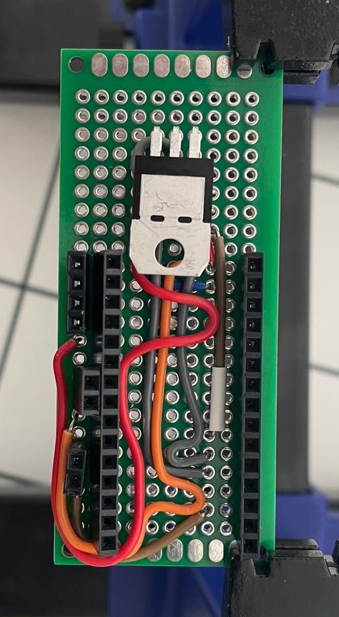
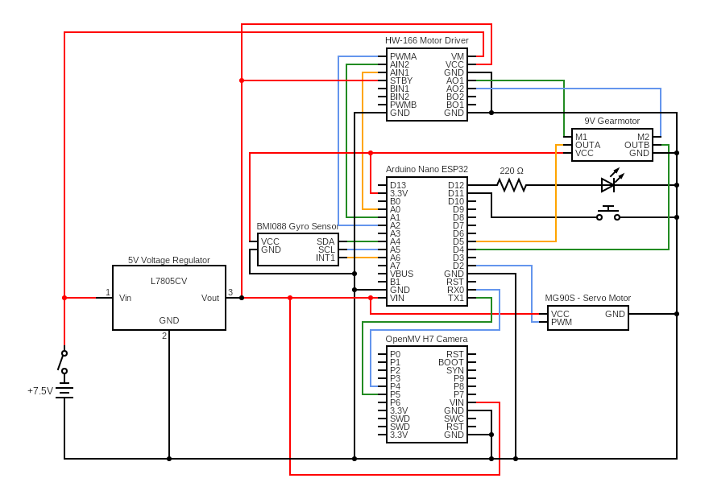

<center><h1> Nerdvana Cancer 2024 </center>


[](https://nerdvana.ro)
[](https://www.facebook.com/nerdvanaro/)
[](https://instagram.com/nerdvana_romania/)
[](https://www.youtube.com/@NerdvanaRomania)

This repository contains the documentation for the Nerdvana Cancer team's robot for the 2024 World Robot Olympiad Future Engineers competition. The robot, was designed and built by a team of three students.

## Table of Contents
* [The Team](#team)
* [The Challenge](#challenge)
* [The Robot](#robot-image)
* [Performance Video](#video)
* [Mobility Management](#mobility-management)
  * [Powertrain](#powertrain-mechanical)
    * [Drivetrain](#drivetrain-mechanical)
    * [Motor](#motor-mechanical)
    * [Motor Driver](#motor-driver-mechanical)
  * [Steering](#steering-mechanical)
    * [Servo Motor](#servo-motor)
  * [Chassis](#chassis-mechanical)
* [Power and Sense Management](#power-and-sense-management)
  * [Li-Po Battery](#li-po-battery)
  * [Arduino Nano ESP32](#arduino-nano-esp32)
  * [IMU](#imu-sensor)
  * [OpenMV Cam H7 R2](#openmv-cam-h7-r2)
  * [Voltage Regulator](#voltage-regulator)
  * [PCB Design](#pcb)
  * [Circuit Diagram](#circuit-diagram)
* [Code for each component](#code-for-each-component)
  * [Drive Motor](#drive-motor-code)
  * [Servo Motor](#servo-motor-code)
  * [Camera](#camera-code)
  * [IMU](#gyro-sensor-code)
* [Obstacle Management](#obstacle-management)
  * [Qualification Round](#quali-management)
  * [Final Round](#final-management)
  * [Additional code](#additional-code)
* [Robot Construction Guide](#robot-construction-guide)
  * [Step 0: Print the 3D parts](#3d-printing)
  * [Step 1: Assemble the steering system](#steering-system-assembly)
  * [Step 2: Assemble the powertrain](#powertrain-assembly)
  * [Step 3: Attach the electronics](#electronics-attachment)
  * [Step 4: Attach the wheels](#wheel-attachment)
  * [Step 5: Final touches](#final-touches)
  * [Step 6: Upload the code](#code-upload)
* [Cost Report](#cost-report)
  * [3D Printing Costs](#3d-printing-costs)
  * [Other Parts Tested](#other-parts-tested)
  * [Tools and Equipment](#tools-and-equipment)
  * [Summary of Costs](#summary-of-costs)
* [Randomizer](#randomizer)
* [Resources](#resources)
  * [3D Models](#3d-models-resources)
  * [Images](#images-resources)
* [License](#copyright)

---

## The Team <a class="anchor" id="team"></a>

### Nicola Victor Teodor
<p align="center">
  
</p>

<b>Age:</b> 18

<b>High School:</b> National College of Informatics "Tudor Vianu", Bucharest

<b>Description:</b> Hi! I’m Victor from Romania and this is my second WRO season. Last year I participated in the RoboMission category and this year I wanted a new challenge. I own the fact that I’m a huge nerd: from coding and robotics, to photography, cinema, music, guitar, and even Formula 1.

---

### Bălan Teodor Ovidiu
<p align="center">
  
</p>

<b>Age:</b> 19

<b>University:</b> University of Bucharest

<b>Description:</b> Wassup y'all! My name is Teodor, and I love traveling and experiencing new things. Since I was a kid, I’ve always been drawn to solving puzzles, playing basketball, discovering new inventions, and thinking of creative ways to do things. Also, I know how to do a backflip. 🤠

---

### Priboi Luca Mihai
<p align="center">
  
</p>

<b>Age:</b> 19

<b>University:</b> Politehnica University of Bucharest

<b>Description:</b> Hello! I am Mihai! I've been participating at WRO since 2015 and I am very excited to be part of the Nerdvana Romania team. My academic passions are programming, physics and robotics, but I also enjoy playing the piano 🎹, whatching movies 🎬, traveling ✈️ and Formula 1 🏎️🏁.

---

### Tuțu Mihai Alexandru
<p align="center">
  
  <p align="center">Nerdvana Romania Founder</p>
</p>

<b>Role:</b> Coach

<b>Description:</b> Hard working young man, objective driven and ready for the long haul. I like challenges and I never back down. The harder, the better. I like being pushed over my limits just to prove myself I can do better.

Very social, I can easily blend in a team. Like to communicate a lot with others and to coordinate with other teammates. I was led and I led teams to certain objectives. I believe the only way to get where you want is to never stop trying and to never give up until you reach your destination.

---

### Priboi Maria Marcela
<p align="center">
  
  <p align="center">Nerdvana Romania Founder</p>
</p>

<b>Role:</b> Manager

<b>Description:</b> I am a very ambitious person, I like to work hard and to be involved in many projects. I am a very organized person and I like to have everything planned. I am a very sociable person and I like to communicate with people. I am a very responsible person and I like to take care of everything that is happening around me. I am a very creative person and I like to come up with new ideas. I am a very determined person and I like to achieve my goals.

---

### Team photo
<p align="center">
  
</p>

## The Challenge <a class="anchor" id="challenge"></a>

The **[WRO 2024 Future Engineers - Self-Driving Cars](https://wro-association.org/)** challenge invites teams to design, build, and program a robotic vehicle capable of driving autonomously on a racetrack that changes dynamically for each round. The competition includes two main tasks: completing laps while navigating randomized obstacles and successfully performing a precise parallel parking maneuver. Teams must integrate advanced robotics concepts such as computer vision, sensor fusion, and kinematics, focusing on innovation and reliability.

This challenge emphasizes all aspects of the engineering process, including:
- **Mobility Management:** Developing efficient vehicle movement mechanisms.
- **Obstacle Handling:** Strategizing to detect and navigate traffic signs (red and green markers) within specified rules.
- **Documentation:** Showcasing engineering progress, design decisions, and open-source collaboration through a public GitHub repository.

Points are awarded based on performance in the challenge rounds, quality of the engineering documentation, and the ability to create an innovative and robust solution. The goal is to inspire STEM learning through real-world robotics applications, teamwork, and creative problem-solving.

Learn more about the challenge [here](https://wro-association.org/wp-content/uploads/WRO-2024-Future-Engineers-Self-Driving-Cars-General-Rules.pdf).

## Photos of our robot MOOYA (Mechanized Optimization for Outstanding Yield and Adaptation) <a class="anchor" id="robot-image"></a>

|  |  | 
| :--: | :--: | 
| *Front* | *Back* |
|  |  | 
| *Left* | *Right* |
|  |  | 
| *Top* | *Bottom* |

<br>

## Our video of the robot on [Youtube](https://www.youtube.com/watch?v=aLT0-nPUaAE) <a class="anchor" id="video"></a>

<br>

# Mobility Management <a class="anchor" id="mobility-management"></a>
<!--  -->

The robot's mobility is managed by a combination of components, including the powertrain, steering system, and chassis. These elements work together to ensure the robot's smooth and efficient movement.

## Powertrain <a class="anchor" id="powertrain-mechanical"></a>

<!--  -->

### Drivetrain <a class="anchor" id="drivetrain-mechanical"></a>

To minimize friction and thereby reduce speed loss, driving axle was made from lego pieces. We conected the motor to the driving axle using a custom 3D-printed adapter. The driving axle has a rear wheel lego differential, which allows the robot to turn smoothly. As the axle was already lego, we used lego wheels.

<br>

**Potential Improvements**:
- Upgrade to a stronger or more precise differential for smoother turning.
- Test alternative materials for the Lego driving axle to reduce weight and increase durability.
- Replace the 3D-printed adapter with a metal one to improve robustness and reliability.

### Motor <a class="anchor" id="motor-mechanical"></a>

<table>
  <tr>
    <td width="50%" style="text-align: left;">
      
    </td>
    <td width="50%" style="text-align: left; vertical-align: top;">
      <h3>Specifications:</h3>
      <li>Voltage: 12V</li>
      <li>Gear Ratio: 1:50</li>
      <li>Speed: 650 ± 31% rpm</li>
      <li>Torque: 0.67 ± kg·cm</li>
      <li>Weight: 9.5g</li>
      </li>
    </td>
  </tr>
</table>

Following an evaluation of different motors, we settled on a micro DC gear motor on which we attached a magnetic encoder. This motor was selected for its lightweight and compact design, which stands out among others with comparable output. Additionally, the magnetic encoder offers greater precision than its optical counterpart. We secured the motor to the chassis using a custom 3D-printed holder.

Where to buy the motor: https://www.pololu.com/product/3039

To connect the motor's axle to a Lego-compatible axle, we created a custom 3D-printed adapter.


To secure the motor to the chassis, we designed a custom 3D-printed holder. The holder is split into two halves, which are then screwed together to ensure the motor remains in place.

 3D piece")

<br>

**Potential Improvements**:
- Consider upgrading to a brushless motor for higher efficiency and better thermal management.
- Implement a more robust motor holder to prevent vibrations and ensure stability.
- Explore alternative motor designs to enhance performance and reduce weight.

### Motor Driver <a class="anchor" id="motor-driver-mechanical"></a>

<table>
  <tr>
    <td width="50%" style="text-align: left;">
      
    </td>
    <td width="50%" style="text-align: left; vertical-align: top;">
      <h3>Specifications:</h3>
      <li>Power supply voltage: VM = 15V max, VCC = 2.7--5.5V</li>
      <li>Output current: Iout = 1.2A (average) / 3.2A (peak)</li>
      <li>Standby control to save power</li>
      <li>CW/CCW/short-brake/stop motor control modes</li>
      <li>Built-in thermal shutdown circuit and low-voltage detecting circuit</li>
    </td>
  </tr>
</table>

To control the speed of the drive motor, we utilized a SparkFun Dual TB6612FNG motor driver.

Where to buy the motor driver: https://www.sparkfun.com/products/14450

<br>

**Potential Improvements**:
- Replace the motor driver with a custom PCB to reduce weight and improve space utilization.
- Add active cooling or heat sinks for enhanced thermal performance during extended use.
- Explore higher-current motor drivers to accommodate potential motor upgrades.
- Implement a more robust power management system to ensure reliable operation.

## Steering <a class="anchor" id="steering-mechanical"></a>

<!--  -->

After experimenting with various steering mechanisms such as Ackermann steering and bell-crank steering, we assessed their advantages and drawbacks. Ultimately, we chose a straightforward steering system consisting of a parallelogram linkage. This decision was made because the alternative systems were either too large or too complex to implement effectively. Our selected mechanism is simple, light, and compact, providing a satisfactory steering angle. While it does not adhere to the Ackermann steering geometry, our tests showed that for our robot's small size and light weight, this omission was not critically significant.

As an upgrade to last year's design, we replaced the Lego-based steering system with a custom 3D-printed one. This change allowed us to reduce the robot's weight and size, while also enhancing its overall performance. The new steering system is more robust and offers greater flexibility in terms of design and implementation.

The steering system is composed of 2 symmetrical wheel holders, that are conected togheter by a steering arm. The steering arm is conected to the servo motor. The joints between the wheel holders and the steering arm are made using steel rods.


<br>

**Potential Improvements**:
- Make the steering angle wider to improve the robot's turning radius.
- Implement Ackermann steering geometry for more precise and efficient turning.
- Use ball-bearing joints in the linkage to reduce friction and increase durability.
- Replace the 3D-printed components with lightweight aluminum for greater strength.

### Servo Motor <a class="anchor" id="servo-motor"></a>

<table>
  <tr>
    <td width="50%" style="text-align: left;">
      
    </td>
    <td width="50%" style="text-align: left; vertical-align: top;">
      <h3>Specifications:</h3>
      <li>Weight: 13.4g</li>
      <li>Stall torque: 2.2 kgf·cm (6V)</li>
      <li>Operating speed: 0.08 s/60 degree (6V)</li>
      <li>Rotation angle: 120 degree</li>
    </td>
  </tr>
</table>

For steering, we selected the MG90S servo motor, favoring it for its high torque and swift response.

Where to buy the servo motor: https://cleste.ro/motor-servo-mg90s-180g.html

<br>

**Potential Improvements**:
- Test servos with a wider rotation angle to improve steering flexibility.
- Integrate position feedback into the servo for real-time adjustment and enhanced precision.

## Chassis <a class="anchor" id="chassis-mechanical"></a>

Our previous attempts at designing a robot for the Future Engineers category were bulky and heavy, mostly lego based. This year, we aimed to create a more compact and lightweight robot. We achieved this by using a almost entirely 3D-printed chassis. Because of this, the fact that we tried to use as few components as possible, the robot is aproximately 50% lighter than last year's robot, while also being more compact.

Another improvement we made was the way of connecting 3D parts togheter. Instead of using lego or screws, we used snapping joints and pins.

The chassis holds basically all of the components. Only the gearmotor and the gyroscope are attached to a separate piece that is then attached to the chassis. The back holds the differential; the middle part has a hole for the battery, on top of which the pcb is mounted using a 3d printed holder. The front holds the camera and the servo motor; the servo mount piece is attached to the chassis as well.


The motor support is a separate piece that holds the motor and the gyroscope. It is attached to the chassis using snapping joints.


<br>

**Potential Improvements**:
- Add vibration-damping materials to minimize disturbances during operation.
- Test modular chassis designs for quicker assembly and maintenance.
- Implement a more aerodynamic shape to reduce drag and improve speed.
- Integrate a suspension system to enhance stability and shock absorption.
- Explore alternative materials for the chassis to improve durability and performance.
- Add a protective cover to shield the components from dust and debris.

# Power and Sense Management <a class="anchor" id="power-and-sense-management"></a>

The robot's power and sense management system is composed of several components, including a Li-Po battery, an Arduino Nano ESP32, an IMU sensor, and an OpenMV Cam H7 R2. These components work together to provide the robot with the necessary power and sensory input to navigate its environment effectively.

### Li-Po Battery <a class="anchor" id="li-po-battery"></a>

<table>
  <tr>
    <td width="50%" style="text-align: left;">
      
    </td>
    <td width="50%" style="text-align: left; vertical-align: top;">
      <h3>Specifications:</h3>
      <li>Capacity: 450mAh</li>
      <li>Voltage: 7.4V/2S</li>
      <li>Discharge rate: 30C</li>
      <li>Weight: 33 g</li>
      <li>Size: 56.5*31*9mm</li>
    </td>
  </tr>
</table>

Where to buy the battery: https://hpi-racing.ro/li-po-2s-74v/acumulator-lipo-gens-ace-g-tech-soaring-450mah-74v-30c-2s1p-cu-jst-syp.html

The battery is mounted using a custom 3D-printed holder, which is secured to the chassis.

<br>

**Potential Improvements**:
- Consider using a higher-capacity battery to extend runtime without increasing weight significantly.
- Add a battery management system (BMS) for better charging and discharging safety.
- Use quick-release connectors for easier battery replacement during competition.
- Implement a battery level indicator to monitor power consumption and remaining charge.

<!--  -->

### Arduino Nano ESP32 <a class="anchor" id="arduino-nano-esp32"></a>

<table>
  <tr>
    <td width="50%" style="text-align: left;">
      
    </td>
    <td width="50%" style="text-align: left; vertical-align: top;">
      <h3>Specifications:</h3>
      <li>Microcontroller: ESP32</li>
      <li>Flash memory: 4MB</li>
      <li>SRAM: 520KB</li>
      <li>Frequency: 240MHz</li>
      <li>Pins: 22</li>
      <li>Input voltage: 5V</li>
    </td>
  </tr>
</table>

At previous competitions, we used many microcontrollers to manage the robot's various components. This year, we opted for the Arduino Nano ESP32, which combines the functionalities of an Arduino Nano and an ESP32. This microcontroller is capable of handling all of the robot's sensors and actuators, providing a more streamlined and efficient solution.

Where to buy the Arduino Nano ESP32: https://store.arduino.cc/products/nano-esp32

The Arduino, mounted on a prototype board, is secured to the chassis with a 3D-printed holder. The pcb is attached to the chassis using screws.


<br>

**Potential Improvements**:
- Design a custom PCB to integrate the Arduino Nano ESP32 with other components for a cleaner setup.
- Test alternative microcontrollers with additional processing power or I/O pins for future scalability.
- Optimize the mounting mechanism to allow easier access for debugging and repairs.
- Implement a power management system to ensure stable voltage supply and prevent damage to the microcontroller.

### IMU <a class="anchor" id="imu-sensor"></a>

<table>
  <tr>
    <td width="50%" style="text-align: left;">
      
    </td>
    <td width="50%" style="text-align: left; vertical-align: top;">
      <h3>Specifications:</h3>
      <li>Gyroscope range: ±2000°/s</li>
      <li>Accelerometer range: ±24g</li>
      <li>Interface: I2C</li>
      <li>Supply voltage: 1.71V to 3.6V</li>
      <li>Current consumption: 0.9mA</li>
    </td>
  </tr>
</table>

One importat aspect that helps the robot navigate is the inertial measurement unit (IMU). This sensor is based on BOSCH BMI088, which is a high-performance IMU with high vibration suppression. While the IMU measure the angular velocity and the acceleration of the robot, we only use the angular velocity to calculate the angle of the robot. The IMU is wired to the SDA and SCL pins on the arduino.

Where to buy the gyro sensor: https://www.seeedstudio.com/Grove-6-Axis-Accelerometer-Gyroscope-BMI088.html

<br>

**Potential Improvements**:
- Explore alternative IMU sensors with higher accuracy and better vibration resistance.
- Implement sensor fusion with additional sensors (e.g., magnetometer) for enhanced navigation.
- Test calibration procedures to minimize drift over longer runs.

### OpenMV Cam H7 R2 <a class="anchor" id="openmv-cam-h7-r2"></a>

<table>
  <tr>
    <td width="50%" style="text-align: left;">
      
    </td>
    <td width="50%" style="text-align: left; vertical-align: top;">
      <h3>Specifications:</h3>
      <li>Microcontroller: STM32H7</li>
      <li>Flash memory: 32MB</li>
      <li>RAM: 512KB</li>
      <li>Frequency: 480MHz</li>
      <li>Resolution: 640x480</li>
      <li>Frame rate: 60fps</li>
    </td>
  </tr>
</table>

The OpenMV Cam H7 R2 is a high-performance camera capable of color tracking. The best feature of this camera compared to other options (like the Pixy cam) is that is has a built-in microcontroller that can process the images and send the results to the Arduino. This way, the Arduino can focus on the robot's movement and the camera can focus on the image processing.

Together with the Arduino Nano ESP32, the camera delivers readings at approximately 60 frames per second.

Where to buy the OpenMV Cam H7 R2: https://openmv.io/products/openmv-cam-h7-r2

<br>

**Potential Improvements**:
- Upgrade to a camera with higher resolution for better object detection and tracking.
- Test alternative lighting solutions to improve visibility in various conditions.
- Implement advanced image processing algorithms to enhance detection accuracy.
- Use color correction algorithms: Apply color correction algorithms to compensate for any variations in lighting conditions. These algorithms can adjust the color values of the captured image to match a reference color space, making the colors more consistent and easier to calibrate.
- Provide user-adjustable parameters: Allow users to manually adjust color thresholds or ranges to fine-tune the color detection. This can be done through a user interface or by providing configuration files that can be modified.
- Implement real-time feedback: Display the detected colors in real-time to the user, along with the calibrated values. This allows users to visually verify the accuracy of the color detection and make adjustments if necessary.

### Voltage regulator <a class="anchor" id="voltage-regulator"></a>

<table>
  <tr>
    <td width="50%" style="text-align: left;">
      
    </td>
    <td width="50%" style="text-align: left; vertical-align: top;">
      <h3>Specifications:</h3>
      <li>Input voltage: 35V max</li>
      <li>Output voltage: 5V</li>
      <li>Output current: 1.5A</li>
      <li>Thermal shutdown circuit</li>
      <li>Short-circuit protection</li>
    </td>
  </tr>
</table>

To provide the Arduino Nano ESP32 with the required 5V, we needed to decrease the output from the 7.4V battery, which can reach up to 8.4V when fully charged. We employed a linear voltage regulator, the L7805CV, capable of converting input voltages below 35V down to a steady 5V.

Where to buy the 5V voltage regulator: https://ro.mouser.com/ProductDetail/STMicroelectronics/L7805CV?qs=9NrABl3fj%2FqplZAHiYUxWg%3D%3D

<br>

**Potential Improvements**:
- Replace the linear voltage regulator with a switching regulator for better efficiency.
- Add heat sinks to the regulator for improved thermal management.
- Design a compact custom regulator circuit to save space.

### PCB design <a class="anchor" id="pcb"></a>

The PCB was made on a prototype board. The board has a voltage regulator, the Arduino Nano ESP32, the motor driver, and connectors for the motor, the servo motor, the IMU, and the camera. The board is powered by the LiPo battery.

| PCB connections | PCB w/ regulator | PCB complete |
| :--: | :--: | :--: |
|  |  |  |

<br>

**Potential Improvements**:
- Transition from prototype boards to fully custom PCBs for better durability and compactness.
- Include dedicated connectors for easier and faster assembly.
- Integrate debugging points on the PCB to simplify troubleshooting.

### Circuit diagram <a class="anchor" id="circuit-diagram"></a>


<br>

# Code for each component <a class="anchor" id="code-for-each-component"></a>

## Drive Motor <a class="anchor" id="drive-motor-code"></a>

The motor driver can be directly managed with a single PWM pin that adjusts the motor's speed and two digital pins designated for determining the motor's rotation direction. Consequently, the use of any external library for motor manipulation was unnecessary.

We devised two functions within our control system: one to modify the motor's velocity and another to halt it effectively, incorporating a braking feature. To achieve this, we convert the desired speed from our established scale of -100 to +100 to the PWM equivalent of 0 to 1023. The motor's direction is then adjusted according to the sign of the input value.

Given the fact that the Arduino has an ESP chip, the PWM signals have to be sent using the ```ledc``` utility.

```ino
void motor_driver_setup() {
  ledcSetup(DRIVER_PWM_CHANNEL, PWM_FREQ, PWM_RES);
  ledcAttachPin(PWMA, DRIVER_PWM_CHANNEL);

  pinMode(AIN1, OUTPUT);
  pinMode(AIN2, OUTPUT);
}

void move_motor(double speed) {  // move the motor with a given speed in the [-100, 100] interval
  int dir = 1;
  if (speed < 0) {
    dir = -1;
    speed *= -1;
  }
  else if (speed == 0) {
    dir = 0;
  }
  speed = map_double(speed, 0, 100, 0, 1023);
  if (dir == 1) { // move the motor forward
    digitalWrite(AIN1, HIGH);
    digitalWrite(AIN2, LOW);
  }
  else if (dir == -1) { // move it backwards
    digitalWrite(AIN1, LOW);
    digitalWrite(AIN2, HIGH);
  }
  else { // implement active break (not used since we don't know how reliable it is)
    digitalWrite(AIN1, LOW);
    digitalWrite(AIN2, LOW);
  }
  ledcWrite(DRIVER_PWM_CHANNEL, (int)speed); // write the speed using PWM
}

void motor_break(long long break_time) { // stop the robot for a given time
  move_motor(-3);
  custom_delay(break_time);
}
```

However, for the encoder, we required a specialized library to handle the more complex signal processing. The library we use for interfacing with the encoder is called ```Encoder.h```.

The encoder operates with a straightforward function that we found easy to comprehend and program. In order to determine the distance in cm, we divided the returned value by 12, since the encoder measures 12 counts per revolution. Then we multiplied this with the gear ratio, wheel diameter and Pi. After that we divided by 10 to convert to cm.

Because of the way the ESP32 chip interacts with the components, in order for this library to properly work, we should select the pin numbering option as "by GPIO number", not as the default "by Arduino pin".

```ino
double read_motor_cm() {  // getting the distance driven by the motor in cm
  return GEAR_RATIO * WHEEL_DIAM * M_PI * (double)myEnc.read() / 12 / 10;
}
```

## Servo Motor <a class="anchor" id="servo-motor-code"></a>

For controlling the servo motor, we utilize the ```Servo.h``` library, which provides the necessary functions to manage the servo's movements. Initially, we configure the servo by establishing its range, defining the maximum and minimum angles it can achieve in both directions. This ensures that we can accurately position the servo within its operational limits.

```ino
void servo_setup() {
  // attach the servo to the right pin and move it to the minimum and maximum angles
  // in the end, center the servo so that we start the program moving straight
  servo.attach(SERVO_PIN);
  for (int deg = servo.read() - 1; deg >= ANGLE_MIN; deg--)
    servo.write(deg);
  custom_delay(500);
  // Serial.println("after ANGLE_MIN");
  for (int deg = servo.read() + 1; deg <= ANGLE_MID; deg++)
    servo.write(deg);
  // Serial.println("after ANGLE_MID");
  for (int deg = servo.read() + 1; deg <= ANGLE_MAX; deg++)
    servo.write(deg);
  custom_delay(500);
  // Serial.println("after ANGLE_MAX");
  for (int deg = servo.read() - 1; deg >= ANGLE_MID; deg--)
    servo.write(deg);
  custom_delay(500);
  // Serial.println("after ANGLE_MID");
  goal_deg = ANGLE_MID;
}
```

The servo motor is controlled dinamically in the loop by setting a goal angle and taking small steps towards that goal at every iteration. This way we make sure that we can send a lot of fast angle changes to the servo and get the wanted results.

The function ```move_servo``` sets the goal angle to the given parameter. If the angle is negative the motor will rotate to the right, and if it is positive, the motor will rotate to left. This way, 0 is going to be the position in which the wheels are straight. Also, the values given the motor need to be between -1 and 1, so we use a clamp function to limit the value we are going to give the motor to rotate to and an interval mapping function to map the parameter from the [-1; 1] interval to the [ANGLE_MIN; ANGLE_MAX] interval.

The function ```update_servo``` takes a small step towards the goal angle as described above.

```ino
void move_servo(double angle) {  // move the servo to the angle checkpoint by setting the goal degrees to the angle value
  goal_deg = map_double(angle, -1, 1, ANGLE_MIN, ANGLE_MAX);
}

void update_servo() { // update the servo, making it closer to the goal angle by a small step
  int current_angle_servo = servo.read();
  if (abs(current_angle_servo - goal_deg) >= ANGLE_VARIANCE_THRESHOLD) { // if we're too far off, directly write the new angle
    servo.write(goal_deg);
  }
  else {
    // increment the angle with a small step in the right direction
    // making sure we don't exceed our angle limitations
    if (current_angle_servo < goal_deg) {
      servo.write(min(current_angle_servo + STEP, ANGLE_MAX));
    }
    else if (current_angle_servo > goal_deg) {
      servo.write(max(current_angle_servo - STEP, ANGLE_MIN));
    }
  }
}

void loop() {
  // other code
  update_servo();
}
```

## Camera <a class="anchor" id="camera-code"></a>

Now that we finished implementing the functions that we need to make the robot move and steer, we have to make it see the lines that trigger the turns, the cubes and the parking walls and move accordingly. To communicate with the camera, we use the ```UART``` protocol. In order for this to work, we must link the ```RX0``` pin on the arduino (the receiver pin) to the ```P4``` pin on the camera (the transmitter pin) and the ```TX1``` pin on the arduino (the transmitter pin) to the ```P5``` pin on the camera (the receiver pin). In addition, the baud rates from the ```Serial0``` object on the arduino and the ```uart``` object on the camera must match.

**Arduino code:**

```ino
void comm_setup() {
  Serial.begin(9600);
  // while(!Serial);
  blink_led(LED_BUILTIN, 500);

  Serial0.begin(19200);
  while(!Serial0); // wait for the serial to properly initialize
  blink_led(LED_BUILTIN, 500);
  receivedMessage = "";
}

void loop() {
  // execute pending commands
  while (Serial0.available() > 0) { // if we have some characters waiting
    char receivedChar = Serial0.read(); // we get the first character
    if (receivedChar == '\n') { // if it's the end of message marker
      if (CASE != PARK) { // if we want to execute commands
        execute(receivedMessage); // execute the received command from the OpenMV camera
      }
      receivedMessage = ""; // reset the received message
    }
    else {
      receivedMessage += receivedChar; // append characters to the received message
    }
  }
}
```

**Camera code:**

```py
# setup UART connection to arduino
uart = UART(3, 19200)
# 3 - the uart config, meaning that we use pins P4 as the transmitter, P5 as the receiver
# 19200 - baud rate aka frequency, must match the one set up on the arduino

# because we have a one-sided communication going on
# we can directly write messages without any supplementary checks
uart.write(msg)
```

In order to detect colors, we have to take pictures in which to search for colors. This is the sequence that sets up the camera sensor. Due to the limitations of the sensor, we couldn't manually adjust the white balance, gain, exposure time or access its registries.

```py
import sensor

# initialize the sensor
sensor.reset()
sensor.set_pixformat(sensor.RGB565)
sensor.set_framesize(sensor.QQVGA)
#sensor.set_framerate(40)
sensor.set_vflip(True)
sensor.set_hmirror(True)

# disable auto gain, white balance, and exposure
sensor.set_auto_gain(False)  # must be turned off for color tracking
sensor.set_auto_whitebal(False)  # must be turned off for color tracking
sensor.set_auto_exposure(False, exposure_us=10000) # set constant exposure for the best visibility

# skip some frames to let the camera adjust
sensor.skip_frames(time=2000)
```

Now for the camera logic, the color tracking is pretty simple: the camera can return blobs of pixels that fit into a certain ```LAB``` threshold representing a color. We can also restrain the blob detection to a rectangle of interest and apply pixel count, bounding rectangle area and density filters as well. The reason for which we do this, is that certain colors, like green, red, blue and orange are pretty common, therefore we don't want the camera to interpret clothes or other objects outside of the map as obstacles. In addition, the orange and red colors, in some light conditions, are quite similar. This is why we apply the pixel count, bounding rectangle area and density filters, to ensure that we are seeing the correct object.

For quali we firstly scan the color of the first seen line. This will give us the direction of the run. Then, we constantly look out for lines that are over a certain area. Once we find one, we send the turn trigger to the Arduino via ```UART```.

```py
while (True):
    clock.tick()
    img = sensor.snapshot()

    # find the coloured blobs corresponding to the turn lines
    orange_blobs = img.find_blobs(orange_threshold, roi=lines_roi, pixels_threshold=line_blob_size, area_threshold=line_blob_size, merge=True)
    blue_blobs = img.find_blobs(blue_threshold, roi=lines_roi, pixels_threshold=line_blob_size, area_threshold=line_blob_size, merge=True)

    orange_blob_w = None
    orange_blob_h = None
    max_width = 0
    max_height = 0
    for blob in orange_blobs:
        if blob.w() >= img.width() * 0.4: # if it meets the minimum width requirement
            if blob.w() > max_width: # if it's the biggest blob yet
                max_width = blob.w()
                orange_blob_w = blob # biggest blob on the width
        if blob.h() >= lines_roi[3] * 0.4: # if it meets the minimum height requirement
            if blob.h() > max_height: # if it's the biggest blob yet
                max_height = blob.h()
                orange_blob_h = blob # biggest blob on the height
    # if we have a blob meeting either the minimum width or height requirement we remember it
    orange_blob = orange_blob_w
    if not orange_blob:
        orange_blob = orange_blob_h

    blue_blob_w = None
    blue_blob_h = None
    max_width = 0
    max_height = 0
    for blob in blue_blobs:
        if blob.w() >= img.width() * 0.4: # if it meets the minimum width requirement
            if blob.w() > max_width: # if it's the biggest blob yet
                max_width = blob.w()
                blue_blob_w = blob # biggest blob on the width
        if blob.h() >= lines_roi[3] * 0.4: # if it meets the minimum height requirement
            if blob.h() > max_height: # if it's the biggest blob yet
                max_height = blob.h()
                blue_blob_h = blob # biggest blob on the height
    # if we have a blob meeting either the minimum width or height requirement we remember it
    blue_blob = blue_blob_w
    if not blue_blob:
        blue_blob = blue_blob_h

    if direction == 0: # if we didn't set a turn direction yet
        if orange_blob: # if the first line we saw was an orange one
            direction = 2
        elif blue_blob: # if the first line we saw was a blue one
            direction = 1

    has_line = False
    if orange_blob or blue_blob: # if we saw either coloured lines, we can make a turn
        has_line = True

    if has_line:
        # if we must turn, send the turn trigger
        uart.write(str(direction) + '\n')
```


## IMU <a class="anchor" id="gyro-sensor-code"></a>

To utilize the gyro sensor, we needed to include the ```BMI088.h``` library. During initialization, we allocate a 10-second window to measure the sensor's drift, allowing us to refine the robot's angular readings for greater precision. Additionally, we configure the sensor's output data rate to 400Hz and set the bandwidth to 47Hz. The bandwidth determines the frequency of data sampling by the sensor; a higher bandwidth yields more precise data at the cost of increased power consumption. We also designate pin A6 as an input and attach an interrupt to it, enabling us to capture data from the sensor as soon as it becomes available.

```ino
void gyro_setup(bool debug) {
  int status = accel.begin();
  status = accel.setOdr(Bmi088Accel::ODR_200HZ_BW_80HZ);
  status = accel.pinModeInt1(Bmi088Accel::PUSH_PULL,Bmi088Accel::ACTIVE_HIGH);
  status = accel.mapDrdyInt1(true);

  status = gyro.begin();

  status = gyro.setOdr(Bmi088Gyro::ODR_400HZ_BW_47HZ);
  status = gyro.pinModeInt3(Bmi088Gyro::PUSH_PULL,Bmi088Gyro::ACTIVE_HIGH);
  status = gyro.mapDrdyInt3(true);

  pinMode(INT_PIN,INPUT);
  attachInterrupt(INT_PIN,gyro_drdy,RISING);

  if(status < 0) {
    if(debug){
      Serial.print("BMI Initialization Error!  error: ");
      Serial.println(status);
    }
  }
  else  {
    // Gyro drift calculation
    if(debug) Serial.println("Starting gyro drift calculation...");

    gx = 0;
    // gy = 0;
    // gz = 0;

    gyro_last_read_time = millis();

    double start_time = millis();
    while(millis() - start_time < DRIFT_TEST_TIME * 1000) {
      gyro.readSensor();
      double read_time = millis();
      gx += (gyro.getGyroX_rads() * (read_time - gyro_last_read_time) * 0.001);
      // gy += (gyro.getGyroY_rads() * (read_time - gyro_last_read_time) * 0.001);
      // gz += (gyro.getGyroZ_rads() * (read_time - gyro_last_read_time) * 0.001);

      gyro_last_read_time = read_time;
    }

    drifts_x = gx / DRIFT_TEST_TIME;
    // drifts_y = gy / DRIFT_TEST_TIME;
    // drifts_z = gz / DRIFT_TEST_TIME;

    if(debug) Serial.print("Drift test done!\nx: ");
    if(debug) Serial.println(drifts_x, 6);
    // if(debug) Serial.print("   y: ");
    // if(debug) Serial.print(drifts_y, 6);
    // if(debug) Serial.print("   z: ");
    // if(debug) Serial.println(drifts_z, 6);
  }
  // Gyro value reset
  gx = 0;
  // gy = 0;
  // gz = 0;

  gyro_last_read_time = millis();
}
```

Within the ```read_gyro``` function, we're retrieving data from the gyro sensor and adjusting it to account for any detected drift, enhancing the accuracy of the readings. Since the gyro provides data in radians, a conversion to degrees is necessary for our application. We're focusing solely on the rotation around the x-axis, hence we only compute the ```gx``` value, which represents the robot's angular rotation in degrees on that specific axis.

```ino
void read_gyro(bool debug) {
  if(gyro_flag) {
    gyro_flag = false;
    gyro.readSensor();   
    double read_time = millis();

    gx += ((gyro.getGyroX_rads() - drifts_x) * (read_time - gyro_last_read_time) * 0.001) * 180.0 / PI;
    // gy += ((gyro.getGyroY_rads() - drifts_y) * (read_time - gyro_last_read_time) * 0.001) * 180.0 / PI;
    // gz += ((gyro.getGyroZ_rads() - drifts_z) * (read_time - gyro_last_read_time) * 0.001) * 180.0 / PI;

    gyro_last_read_time = read_time;

    if(debug) {
      Serial.print("Gyro: gx: ");
      Serial.println(gx);
      // Serial.print(" gy: ");
      // Serial.print(gy);
      // Serial.print(" gz: ");
      // Serial.println(gz);
    }
  }
}
```

<br>

# Obstacle Management <a class="anchor" id="obstacle-management"></a>

## Qualification Round <a class="anchor" id="quali-management"></a>

For the qualifying round, we set up a basic switch-case system to guide our robot. This system tells the robot what to do next, depending on where it is. The robot knows where it is by counting how many times it has turned.

We use two main switch cases: ```PID``` and ```STOP_QUALI```.

In the ```PID``` case, the robot moves straight and turns. It uses a special tool (PID controller) with a gyro sensor to stay on a straight line. If it sees a corner line, it gets a trigger from the camera to make a turn by adding 90 degrees to the goal angle.

```ino
case PID: {
  check_and_execute_turnaround(gx);
  double err = current_angle_gyro - gx;
  if (millis() - last_rotate > FIRST_STOP_DELAY && turns >= 12) { // if we did 3 runs of the round
    if (FINAL) {
      CASE = STOP_BEFORE_FIND_PARKING; // we need to stop and search for the parking
    }
    else {
      CASE = STOP_QUALI; // stop, challenge over
    }
  }
  else {
    // classic pid on the gyro so that we can move straight
    pid_error_gyro = (err) * kp_gyro + (pid_error_gyro - pid_last_error_gyro) * kd_gyro;
    pid_last_error_gyro = pid_error_gyro;
    move_servo(pid_error_gyro);
  }
  move_motor(MOTOR_SPEED);
  break;
}

case STOP_QUALI: {
  // we finished the challenge, stop the robot
  move_until_angle(MOTOR_SPEED, current_angle_gyro);
  move_cm_gyro(10, MOTOR_SPEED, current_angle_gyro);
  is_running = false;
  Serial.println("Stop case");
  motor_break(1000000000);
}
```

### Line Detection


## Final Round <a class="anchor" id="final-management"></a>

For the final round, we based our controller algorithm on the quali code, adding a PID controller on the camera to follow the closest cube until it is in its proximity. In order to get the closest cube to the robot we just search for the biggest red or green coloured blob in the image.
After we're in the cube's proximity, we send a trigger from the camera to the arduino with the cube color so that we can start avoiding it.

```py
img = sensor.snapshot()

# find the coloured blobs corresponding to the cubes
red_blobs = img.find_blobs(red_threshold, roi=cubes_roi, pixels_threshold=min_cube_size, area_threshold=min_cube_size, merge=True)
green_blobs = img.find_blobs(green_threshold, roi=cubes_roi, pixels_threshold=min_cube_size, area_threshold=min_cube_size, merge=True)

msg = "0\n"
max_area = 0
color = 'none'
saved_cube = None
for blob in red_blobs: # for every red blob
    # if they're passing the height and density filters
    # we're keeping the biggest one and its color
    if is_cube(blob, orange_blob, parking_blobs) and blob.area() > max_area:
        max_area = blob.area()
        saved_cube = blob
        color = 'red'
for blob in green_blobs: # for every green blob
    # if they're passing the height and density filters
    # we're keeping the biggest one and its color
    if is_cube(blob, blue_blob, parking_blobs) and blob.area() > max_area:
        max_area = blob.area()
        saved_cube = blob
        color = 'green'

if saved_cube != None: # if we saw a cube
    # if the cube area is over a certain threshold
    # it means we must avoid the cube as we are too close to it
    if (color == 'red' and saved_cube.pixels() >= max_cube_size_red) or (color == 'green' and saved_cube.pixels() >= max_cube_size_green):
        # send the right trigger
        if color == 'red':
            uart.write('R\n')
        else:
            uart.write('G\n')
        if has_line:
            # if we must also turn, send the trigger
            uart.write(str(direction) + '\n') # send the turn trigger
    else: # if the cube isn't too big we must follow it
        # calculate the angle using PID
        err = saved_cube.cx() - img.width() / 2
        steering = err * kp + (err - err_old) * kd
        steering = -clamp(steering, -1, 1)
        err_old = err
        # craft the command
        if color == 'red':
            msg = 'r' + str(steering) + '\n'
        else:
            msg = 'g' + str(steering) + '\n'
        uart.write(msg) # send the message
        if has_line:
            # if we must also turn, send the turn trigger
            uart.write(str(direction) + '\n')
elif has_line: # if we don't see any cubes
    # if we must turn, send the turn trigger
    uart.write(str(direction) + '\n')
```

### Cube Detection


---

The arduino part is quite simple, consisting of the quali switch but with two extra cases: ```FOLLOW_CUBE``` and ```AFTER_CUBE```. In the ```FOLLOW_CUBE``` case we just write to the servo the steering angle calculated by the PID algorithm ran on the camera. After we get the proximity trigger from the camera, we have a custom function called ```pass_cube``` which steers us away from the cube and puts us in the ```AFTER_CUBE``` state. This case consists of two substates: in the first one the robot steers in the opposite direction to center itself again and the second one in which the robot uses a PID with the gyro to move an additional distance so that we're perfectly positioned to see the next cube. After that, we go back to the default ```PID``` case that is used in the quali code.

```ino
// hardcoded sequence that avoids a cube
void pass_cube(int cube_last) {
  int angle_addition = 0;
  if (cube_last == 1) // due to a slight asymmetry in the steering, when avoiding red cubes we need to steer less
    angle_addition = -9;
  read_gyro(false);
  int start_angle = gx;
  move_until_angle(MOTOR_SPEED, start_angle - cube_last * (AVOIDANCE_ANGLE + angle_addition)); // steer away from the cube
  // gain some distance
  if (abs(current_angle_gyro - start_angle) >= 10) // if we passed by it while crooked in regards to the goal line we need to overcompensate in order to see the next cube
    move_cm_gyro(16, MOTOR_SPEED, start_angle - cube_last * (AVOIDANCE_ANGLE + angle_addition));
  else
    move_cm_gyro(7, MOTOR_SPEED, start_angle - cube_last * (AVOIDANCE_ANGLE + angle_addition));
  CASE = AFTER_CUBE;
}
```

```ino
case FOLLOW_CUBE: {
  check_and_execute_turnaround(gx);
  if (millis() - last_rotate > FIRST_STOP_DELAY && turns >= 12) { // if we did 3 runs of the obstacle round, we need to stop and search for the parking
    CASE = STOP_BEFORE_FIND_PARKING;
  }
  else {
    if (millis() - last_follow_cube > FOLLOW_CUBE_DEAD_TIME) // if we lost the cube, we just go back to the default PID case
      CASE = PID;
    // write to the servo the pid computed on the camera in order to follow the cube
    move_servo(follow_cube_angle);
    move_motor(MOTOR_SPEED);
  }
  break;
}

case AFTER_CUBE: {
  check_and_execute_turnaround(gx);
  if (millis() - last_rotate > FIRST_STOP_DELAY && turns >= 12) { // if we did 3 runs of the obstacle round, we need to stop and search for the parking
    CASE = STOP_BEFORE_FIND_PARKING;
  }
  else {
    double err = current_angle_gyro - gx + cube_last * CORRECTION_ANGLE;
    if (abs(err) < 5) {
      // after we avoid the cube, move forward a bit more so that we're positioned
      // to see the next cube
      if (cube_last == turn_direction) // compensate less on the inside
        move_cm_gyro(5, MOTOR_SPEED, current_angle_gyro + cube_last * CORRECTION_ANGLE);
      else
        move_cm_gyro(10, MOTOR_SPEED, current_angle_gyro + cube_last * CORRECTION_ANGLE);
      CASE = PID;
    }
    else {
      // classic pid on the gyro so that we can move in the opposite direction
      // so that we can see the next cube
      pid_error_gyro = (err) * kp_gyro + (pid_error_gyro - pid_last_error_gyro) * kd_gyro;
      pid_last_error_gyro = pid_error_gyro;
      move_servo(pid_error_gyro);
    }
  }
  move_motor(MOTOR_SPEED);
  break;
}
```

The next challenge in this round consists in the final turnaround. If the last seen cube is red, we need to do a roundabout and complete the last lap in the opposite direction. The way we deal with this is a function that checks if we should turn around and executes it if necessary. This function is called in the ```PID```, ```FOLLOW_CUBE``` and ```AFTER_CUBE``` cases.

```ino
void check_and_execute_turnaround(double gx) {
  // if we didn't do the turnaround yet
  // and we did 2 runs of the map
  // and the last seen cube is red
  // and some time passed since the 8th turn
  // (so that we can see the first cube in the starting sequence in case this sequence had 2 cubes and we spawned between them)
  if (!FINAL)
    return;
  if (!TURNED && turns == 8 && cube_last == 1 && millis() - last_rotate > TURNAROUND_DELAY) { // may have to take out the time condition for any case except AFTER_CUBE
    move_until_angle(MOTOR_SPEED, current_angle_gyro + turn_direction * TURNAROUND_ANGLE);
    if (-cube_last == turn_direction) { // if i avoided the cube on the inside, i don't have too much room
      move_cm_gyro(5, MOTOR_SPEED, current_angle_gyro + turn_direction * TURNAROUND_ANGLE); // position ourselves so that we have room to turn around
    }
    else {
      move_cm_gyro(17, MOTOR_SPEED, current_angle_gyro + turn_direction * TURNAROUND_ANGLE); // position ourselves so that we have room to turn around
    }
    turn_direction *= -1;
    current_angle_gyro += turn_direction * 180;
    move_until_angle(MOTOR_SPEED, current_angle_gyro + turn_direction * TURNAROUND_ANGLE);
    TURNED = true;
    CASE = PID;
  }
}
```

The final challenge in this round consists in parking the robot. The way we implement this is based on the quali. Basically we want to move as close to the outer walls as possible so that we're perfectly positioned for the parking and avoid all of the cubes. How we achieve this is by going perpendicular to the outside walls after we finish the obstacle round (see the ```POSITION_BEFORE_FIND_PARKING``` case). The goal is to position ourselves as close as possible to them. After we receive a trigger from the camera saying that we're in its proximity, we straighten ourselves out and start the basic quali code.

While moving around the map like this (in the ```FIND_PARKING``` case), we are constantly scanning for magenta blobs that represent the parking walls. When we detect them, we send a trigger from the camera to the arduino and then we have a hardcoded sequence that puts us between the walls, perfectly parallel to them, implemented in the ```POSITION_FOR_PARK``` case. After that, we move straight in order to get closer to the outer wall (see the ```PARK``` case). When we receive the trigger from the camera, move a couple of cm straight and stop the robot.

Camera code:

```py
# find the coloured blobs corresponding to the parking walls
parking_blobs = img.find_blobs(parking_threshold, roi=parking_roi, pixels_threshold=parking_blob_size_min, area_threshold=parking_blob_size_min, merge=True)
parking_wall_blob = get_biggest_blob(parking_blobs)

# find the coloured blobs corresponding to the outside walls
wall_blobs = img.find_blobs(black_threshold, roi=wall_roi, pixels_threshold=wall_blob_size, area_threshold=wall_blob_size, merge=True)
outer_wall = get_biggest_blob(wall_blobs)

if is_parking_wall(parking_wall_blob):
    # if we saw the parking walls, send the parking trigger
    uart.write('P\n')
if wall_blobs:
    # if the wall is big enough, send a slightly different message that helps us when parking
    # if not, send the classic one
    if outer_wall.pixels() >= wall_roi_area and outer_wall.area() >= wall_roi_area:
        uart.write('WP\n')
    else:
        uart.write('W\n')
```

### Parking Wall Detection


---

**Arduino code:**

```ino
case STOP_BEFORE_FIND_PARKING: {
  // straighten ourselves, start searching for the parking
  motor_break(1000);
  CASE = POSITION_BEFORE_FIND_PARKING;
  break;
}

case POSITION_BEFORE_FIND_PARKING: {
  // classic pid on the gyro so that we can move perpendicular to the walls
  // we don't just call the move_until_angle function so that we can still execute commands
  double err = current_angle_gyro - gx - turn_direction * 90;
  pid_error_gyro = (err) * kp_gyro + (pid_error_gyro - pid_last_error_gyro) * kd_gyro;
  pid_last_error_gyro = pid_error_gyro;
  move_servo(pid_error_gyro);
  move_motor(MOTOR_SPEED);
  break;
}

case FIND_PARKING: {
  // classic pid on the gyro so that we can move straight
  // basically immitating a quali run until we find the parking spot
  double err = current_angle_gyro - gx;
  pid_error_gyro = (err) * kp_gyro + (pid_error_gyro - pid_last_error_gyro) * kd_gyro;
  pid_last_error_gyro = pid_error_gyro;
  move_servo(pid_error_gyro);
  move_motor(MOTOR_SPEED);
  break;
}

case POSITION_FOR_PARK: {
  // hardcoded sequence of moves that positions us in the parking spot
  // after that, we just get closer to the outside wall so that we're fully in
  move_cm_gyro(10, PARKING_SPEED, current_angle_gyro);
  move_until_angle(PARKING_SPEED, current_angle_gyro + turn_direction * 90);
  move_until_angle(PARKING_SPEED, current_angle_gyro - turn_direction * 90);
  CASE = PARK;
  break;
}

case PARK: {
  // classic pid on the gyro so that we can move straight into the parking space
  // we don't just call the move_until_angle function so that we can still execute commands
  double err = current_angle_gyro - gx - turn_direction * 90;
  pid_error_gyro = (err) * kp_gyro + (pid_error_gyro - pid_last_error_gyro) * kd_gyro;
  pid_last_error_gyro = pid_error_gyro;
  move_servo(pid_error_gyro);
  move_motor(PARKING_SPEED);
  break;
}

case STOP_FINAL: {
  // we finished the challenge, stop the robot
  is_running = false;
  Serial.println("Stop case");
  motor_break(1000000000);
}
```

## Additional code <a class="anchor" id="additional-code"></a>

**Arduino code:**

In order to clean up the code, we designed some additional functions. Whenever we want to call locomotion functions or delay functions, functions that would break the continuity of the loop function, we must do two things to make sure everything keeps working: flush the characters sent by the camera (using the ```flush_messages``` function) and read the gyro data. That's why we implemented a custom delay function and our locomotion functions are a bit atypical.

```ino
void flush_messages() { // flushing messages like this so that we don't get sections of messages
  // improves the stability of the communication
  while (Serial0.available() > 0) { // if we have some characters waiting
    char receivedChar = Serial0.read(); // we get the first character
    if (receivedChar == '\n') { // if it's the end of message marker
      receivedMessage = ""; // reset the received message
    }
    else {
      receivedMessage += receivedChar; // append characters to the received message
    }
  }
}

void custom_delay(long long delay_time) { // delay function that flushes all of the data
  long long start_time = millis();
  while (millis() - start_time < delay_time) {
    read_gyro(false);
    flush_messages();
  }
}
```

Functions used for locomotion:
```ino
// makes the robot move until it reaches a certain gyro angle
void move_until_angle(double speed, double gyro_offset) {
  int sign = 1;
  if (speed < 0) // if we're moving backwards, we need to steer in the opposite direction
    sign = -1;
  read_gyro(false);
  double err = gyro_offset - gx;
  while (abs(err) >= 10) { // while the error is too big
    // pid on the gyro so that we're moving towards the goal angle
    read_gyro(false);
    err = gyro_offset - gx;
    pid_error_gyro = (err) * kp_gyro + (pid_error_gyro - pid_last_error_gyro) * kd_gyro;
    pid_last_error_gyro = pid_error_gyro;
    move_servo(pid_error_gyro * sign);
    update_servo();
    move_motor(speed);
    flush_messages();
  }
}

// makes the robot move a certain distance at a certain gyro angle
void move_cm_gyro(double dis, double speed, double gyro_offset) {
  double start_cm = read_motor_cm();
  int sign = 1;
  if (speed < 0) // if we're moving backwards, we need to steer in the opposite direction
    sign = -1;
  while (abs(read_motor_cm() - start_cm) < dis) { // while we haven't moved the requested distance
    // pid on the gyro so that we're moving at the correct angle
    read_gyro(false);
    double err = gyro_offset - gx;
    pid_error_gyro = (err) * kp_gyro + (pid_error_gyro - pid_last_error_gyro) * kd_gyro;
    pid_last_error_gyro = pid_error_gyro;
    move_servo(pid_error_gyro * sign);
    update_servo();
    move_motor(speed);
    flush_messages();
  }
}
```

Lastly, we receive multiple types of commands from the camera, from different triggers, to cube following and avoiding commands. All of these take various forms, therefore we need a function that parses every command and executes it. This is where the ```execute``` and ```valid_command``` functions come in handy. The ```execute``` function executes the command only if the ```valid_command``` function says it's valid.

```ino
bool valid_command(String cmd) { // function that checks the validity of a command received from the camera
  if (cmd == "")
    return false;
  if ('0' <= cmd[0] && cmd[0] <= '9') {
    if (cmd[0] > '2' || cmd[0] == '0')
      return false;
    if (cmd.length() != 1)
      return false;
  }
  if (cmd[0] == '+' || cmd[0] == '-' || cmd[0] == '.')
    return false;
  return true;
}

// function that parses a command and executes it
void execute(String cmd) {
  if (!valid_command(cmd))
    return;

  // the following sequence gets the number from the command (if available)
  int pos = 0, sign = 1;
  if (cmd[pos] == 'r' || cmd[pos] == 'g')
    pos++;
  // manually going over the signs since the .toDouble function wouldn't parse them on its own
  if (cmd[pos] == '+')
    sign = 1, pos++;
  else if (cmd[pos] == '-')
    sign = -1, pos++;
  double val = cmd.substring(pos).toDouble();

  if (FINAL) { // if we're in the final round
    if (CASE == FIND_PARKING && cmd[0] == 'P') { // if we're searching for the parking spot and we find it
      CASE = POSITION_FOR_PARK; // park the robot
      return;
    }

    if (cmd[0] == 'P') // if we see the parking slot, but we didn't finish the obstacle round we ignore it
      return;

    if (CASE == POSITION_BEFORE_FIND_PARKING && cmd[0] == 'W') { // if we're positioning ourselves close to the wall and we're in its proximity
      move_until_angle(MOTOR_SPEED, current_angle_gyro); // straighten ourselves
      CASE = FIND_PARKING; // start searching for the parking lot
      return;
    }

    if (CASE == PARK && (cmd[0] == 'W' && cmd[1] == 'P')) { // if we're positioning ourselves close to the wall and we're in its proximity
      move_cm_gyro(2, PARKING_SPEED, current_angle_gyro - turn_direction * 90); // position ourselves closer
      CASE = STOP_FINAL; // we finished the parking, stop
      return;
    }

    if (cmd[0] == 'W') // if we see the outer wall, but we don't need it we ignore it
      return;

    if (CASE != FIND_PARKING && CASE != POSITION_BEFORE_FIND_PARKING) {
      if (cmd[0] == 'R' || cmd[0] == 'G') { // if we're in the proximity of a cube
        if (cmd[0] == 'R') { // we determine the direction in which we avoid the cube
          cube_last = 1;
        }
        else {
          cube_last = -1;
        }
        pass_cube(cube_last);
        return;
      }
      if (cmd[0] == 'r' || cmd[0] == 'g') { // if we see a cube but we're not close enough to avoid it
        follow_cube_angle = val * sign;
        CASE = FOLLOW_CUBE;
        last_follow_cube = millis();
        return;
      }
    }
  }
  
  int msg = (int)val;
  if (msg) { // a turn was detected
    if (turn_direction == 0) { // if we don't know the direction yet
      if (msg == 1) { // blue line
        turn_direction = 1;
      }
      else { // orange line
        turn_direction = -1;
      }
    }
    if (millis() - last_rotate > delay_walls) { // if we can make a turn
      if (CASE == FIND_PARKING) { // if we're searching for the parking spot
        // if we're at the first turn, we have to move more in order to position ourselves close to the outer walls
        move_cm_gyro(CORNER_DISTANCE_PARKING, MOTOR_SPEED, current_angle_gyro);
      }
      else if (0 < (current_angle_gyro - gx) * turn_direction && (current_angle_gyro - gx) * turn_direction < 10) { // if we're during the obstacle round or in the quali and we're straight
        // position ourselves in order to not hit the walls
        if (FINAL)
          move_cm_gyro(CORNER_DISTANCE_FINAL, MOTOR_SPEED, current_angle_gyro);
        else
          move_cm_gyro(CORNER_DISTANCE_QUALI, MOTOR_SPEED, current_angle_gyro);
      }
      else if (CASE == AFTER_CUBE) { // if we're crooked after avoiding a cube we position ourselves for the turn
        if (-cube_last == turn_direction) { // if we passed by it in the turn's direction then we just need to straighted ourselves for more manuver room
          move_until_angle(MOTOR_SPEED, current_angle_gyro);
        }
        else {
          move_until_angle(MOTOR_SPEED, current_angle_gyro + turn_direction * 30);
          move_cm_gyro(7, MOTOR_SPEED, current_angle_gyro + turn_direction * 30);
        }
        CASE = PID;
      }
      current_angle_gyro += turn_direction * 90; // update the goal angle for the next sequence
      turns++; // increase the number of turns made
      delay_walls = 2500; // larger delay for every turn except the first one
      // as we may have the starting position close to the first turn
      last_rotate = millis(); // update the last time we turned
    }
  }
}
```

**Camera code:**

In order to make the robot more stable in any light conditions, we had to make sure that the red, orange and magenta, respectively the green and the blue colors don't get confused in the color detection process. That's why in order to ensure the best accuracy we fine tuned our color thresholds so that we can never see magenta/orange on a red cube or blue on a green cube. The problem that remained is that we saw red in magenta/orange and green in blue. That's why we came up with a simple solution: if a red/green blob is inside another blob that can be mixed up with, such as a line blob or a parking wall blob, we simply ignore it, as it is a false cube detected.

```py
# detects if a blob is partially inside another blob
# by checking if the center of one blob is inside the minimum area rectangle that wraps the other blob
# giving the fact that this rectangle may be crooked, we have to use a special algorithm
# that is designed to check whether a point is inside a polygon or not based on the coordinates
def is_blob_in_blob(blob, blob2):
    if not blob2:
        return False
    polygon = blob2.min_corners()
    num_vertices = len(polygon)
    (x, y) = (blob.cx(), blob.cy())
    inside = False

    # store the first point in the polygon
    (p1x, p1y) = (polygon[0][0], polygon[0][1])

    # loop through each edge in the polygon
    for i in range(1, num_vertices + 1):
        # get the next point in the polygon
        (p2x, p2y) = (polygon[i % num_vertices][0], polygon[i % num_vertices][1])

        # check if the point is above the minimum y coordinate of the edge
        # check if the point is below the maximum y coordinate of the edge
        # check if the point is to the left of the maximum x coordinate of the edge
        if y > min(p1y, p2y) and y <= max(p1y, p2y) and x <= max(p1x, p2x):
            # calculate the x-intersection of the line connecting the point to the edge
            x_intersection = (y - p1y) * (p2x - p1x) / (p2y - p1y) + p1x

            # check if the point is on the same line as the edge or to the left of the x-intersection
            if p1x == p2x or x <= x_intersection:
                # flip the inside flag
                inside = not inside

        # store the current point as the first point for the next iteration
        (p1x, p1y) = (p2x, p2y)

    # return the value of the inside flag
    return inside

# checks whether a blob is a cube or not based on the minimum height and density filters
# as well as another check:
# since in some light conditions the red the cube may be similar to the orange line or magenta parking walls
# and in some light conditions the green the cube may be similar to the blue line
# we have to check if the possible cube blob is inside any of these ones
# if it is, then it may just be a false alarm and we should ignore it
def is_cube(blob, line_blob, parking_blobs):
    if blob.density() >= density_thr and blob.h() > min_cube_height and not is_blob_in_blob(blob, line_blob):
        for parking_wall_blob in parking_blobs:
            if is_blob_in_blob(blob, parking_wall_blob):
                return False
        return True
    return False
```

In addition, we created the following functions in order to avoid code repetition or to break down complicated conditions.

```py
# function that gets the biggest blob by size
def get_biggest_blob(blob_array):
    max_area = 0
    max_blob = None
    for blob in blob_array:
        # we're keeping the biggest parking blob
        if blob.area() > max_area:
            max_area = blob.area()
            max_blob = blob
    return max_blob

# checks if a parking wall blob meets the height and size requirements
def is_parking_wall(blob):
    if not blob:
        return False
    if blob.pixels() >= parking_blob_size_trigger and blob.area() >= parking_blob_size_trigger:
        return True
    if blob.h() >= parking_blob_height_trigger:
        return True
    return False
```

<br>

# Robot Construction Guide <a class="anchor" id="robot-construction-guide"></a>

## Step 0: Print the 3D parts <a class="anchor" id="3d-printing"></a>

The part files can be found in the `3d-models` folder. We used and recommend the [BambuLab X1-Carbon](https://bambulab.com/en/x1) 3D printer, with the following settings:
 - Material: PLA
 - Layer height: 0.2mm
 - Infill: 20%
 - Supports: Yes
 - Raft: No
 - Brim: Yes

## Step 1: Assemble the steering system <a class="anchor" id="steering-system-assembly"></a>

1. Mount the `servo` on the `chassis` using 2 zip ties, make sure to cut the excess of the zip ties so it doesnt interfere with the steering arm.

2. Attach the `steering axle` to the `servo` using a ⌀ 2mm metal rod, approximately 4-5mm in length.

3. Attach the `servo mount` to the `chassis` using the peg joints.

4. Hold the `steering hubs` between the `chassis` and the `servo mount` and attach them with a ⌀ 2mm metal rod, approximately 20mm in length.

5. Attach the `steering axle` to the `steering hubs` using two ⌀ 2mm metal rod, approximately 20mm in length.

6. Inside the `steering hubs`, place a `Pin Connector Block`(<a href="https://www.bricklink.com/v2/catalog/catalogitem.page?P=39793&idColor=11#T=C&C=11">39793</a>) using pins. Put a `Axle 3L with Stop`(<a href="https://www.bricklink.com/v2/catalog/catalogitem.page?P=24316&idColor=11#T=C&C=11">24316</a>) inside the `Pin Connector Block`.

## Step 2: Assemble the powertrain <a class="anchor" id="powertrain-assembly"></a>
1. Attach the `motor support` to the `chassis` using the peg joints.

2. Attach the `motor` to the `motor support` using the `motor mounts` and *M3* screws.

3. On the `motor`, attach the `gearmotor to axle` and, on the other end, attach a lego `Axle 3L`.

4. On the other end of the `Axle 3L`, attach a lego `Gear 20 Tooth Double Bevel`(<a href="https://www.bricklink.com/v2/catalog/catalogitem.page?P=32269#T=C">32269</a>)

5. The `chasiss` has a place for a differential, attach a `Gear Differential 28 Tooth Bevel`(<a href="https://www.bricklink.com/v2/catalog/catalogitem.page?P=62821b&name=Technic,%20Gear%20Differential%2028%20Tooth%20Bevel%20-%20Inner%20Tabs%20with%20Closed%20Center&category=%5BTechnic,%20Gear%5D#T=C">62821b</a>) there, connected to the `Gear 20 Tooth Double Bevel`. The differential should have 3 `Gear 12 Tooth Bevel`(<a href="https://www.bricklink.com/v2/catalog/catalogitem.page?P=6589#T=C">6589</a>) inside it. The differential should be attached to the `chassis` using lego `Axles 7L`. Where the `Axles 7L` go, there should be a half stud gap in the `chassis`, place a `Bush 1/2`(<a href="https://www.bricklink.com/v2/catalog/catalogitem.page?P=4265c&idColor=3#T=C&C=3">4265c</a>) on each side. This will hold the wheels in place better.

## Step 3: Attach the electronics <a class="anchor" id="electronics-attachment"></a> 

1. Make the `pcb` using a `10x24 prototype board`. Using the `electrical diagram` and the pcb images, solder the connections, and headers and the `voltage regulator`. Place the `Arduino Nano ESP32` and `motor driver` on the pcb. The pcb should be attached to the `pcb plaque` using screws.

2. Place the `battery` in under the `pcb` in the place provided in the `chassis`.

3. Use a `6x12 prototype board` to make a holder for the `power switch` and `start button`, which need to be souldered. On the bottom of the board, soulder headers so that you can use father-father wires to connect to the arduino. We used a longer prototype board and cut it to the desired size. The holder should be attached to the `chassis` using double sided tape. You can also soulder a `led` to the board and connect it to the arduino for debuging purposes.

4. Attach the `IMU` to the `motor support` using screws. Soulder a wire on the `IMU` on the `INT1` pin.

5. Attach the `camera` to the `chassis` using screws. The `camera` should be slighly tilted up.

6. Connect all the wires according to the `electrical diagram`. The `camera` should be connected to the `Arduino` using the `UART` protocol. The `IMU` should be connected to the `Arduino` using the `I2C` protocol. The wires can be store bought, or you can make them yourself. We custom-made our wires to achieve the exact lengths needed and combined certain connections into single Dupont connectors—for example, the camera power, camera UART, and IMU I2C wires are each grouped within individual Dupont connectors.

7. (Optional) All the wires that are longer than needed can be wrapped arrond the `chassis` to make the robot look cleaner. You can use zip ties to secure the wires in place.

## Step 4: Attach the wheels <a class="anchor" id="wheel-attachment"></a>

1. Attach the front `wheels`(<a href="https://www.bricklink.com/v2/catalog/catalogitem.page?P=39367pb01&idColor=11#T=C&C=11">39367pb01</a>) to the `Axles 3L with Stop`. Use a `Bush 1/2` on each side of the `wheels` to hold them in place.

2. Attach the back `wheels`(<a href="https://www.bricklink.com/v2/catalog/catalogitem.page?P=39367pb01&idColor=11#T=C&C=11">39367pb01</a>)  to the `Axles 7L`. Use a `Bush 1/2` on each side of the `wheels` to hold them in place. Also add spacers so the wheels are on the same level as the front ones.

## Step 5: Final touches <a class="anchor" id="final-touches"></a>

1. Place a *100g* weight on the back of the robot and one on the `servo mount` to enhance stability and increase grip. The weights should stay in place, but you can stabilize them with some duct tape.

## Step 6: Upload the code <a class="anchor" id="code-upload"></a>

1. Connect the `Arduino` to your computer using a USB cable.

2. Open the `Arduino IDE` and install the ESP32 board manager.

3. Upload the code to the `Arduino`.

4. Connect the `OpenMV Cam H7` to the your computer using a USB cable.

5. Open the `OpenMV IDE` and upload the code to the `OpenMV Cam H7`.

<br>

# Cost Report <a class="anchor" id="cost-report"></a>

## Components <a class="anchor" id="components-cost"></a>

| Component                                   | Quantity | Cost per Unit (€) | Total (€) |
|---------------------------------------------|----------|--------------------|-----------|
| 50:1 Micro Metal Gearmotor HPCB 12V         | 1        | 21.00             | 21.00     |
| SparkFun Motor Driver - Dual TB6612FNG      | 1        | 13.00             | 13.00     |
| Motor Servo MG90S                           | 1        | 4.00              | 4.00      |
| LiPo Battery (450mAh, 7.4V, 30C)            | 1        | 9.00              | 9.00      |
| Arduino Nano ESP32                          | 1        | 24.00             | 24.00     |
| Grove - 6-Axis Accelerometer & Gyroscope    | 1        | 26.50             | 26.50     |
| OpenMV Cam H7 R2                            | 1        | 60.50             | 60.50     |
| Prototype Boards                            | 2        | 5.00              | 10.00     |
| Metal Rods (2mm diameter, various lengths)  | 6        | 0.50              | 3.00      |
| 100g Fishing Weights                        | 2        | 5.00              | 10.00     |
| **LEGO Pieces:**                            |          |                    |           |
| Pin Connector Block (39793)                 | 2        | 0.40              | 0.80      |
| Axle 3L with Stop (24316)                   | 2        | 0.50              | 1.00      |
| Gear 20 Tooth Double Bevel (32269)          | 1        | 1.20              | 1.20      |
| Gear Differential 28 Tooth Bevel (62821b)   | 1        | 3.50              | 3.50      |
| Gear 12 Tooth Bevel (6589)                  | 3        | 0.50              | 1.50      |
| Axles 7L                                    | 2        | 0.60              | 1.20      |
| Bush 1/2 (4265c)                            | 4        | 0.20              | 0.80      |
| Wheels (39367pb01)                          | 4        | 2.00              | 8.00      |

**Total for Components:** **€201.00**

---

## 3D Printing Costs <a class="anchor" id="3d-printing-costs"></a>

- **Filament Used:**
  - Prototypes: 1kg of PLA filament
  - Final Parts: 80g of PLA-CF filament
- **PLA-CF Filament Cost:** €32.00 per 1kg
- **PLA Filament Cost:** €25.00 per 1kg

| Filament Use      | Weight (g) | Cost (€) |
|--------------------|------------|----------|
| Prototypes         | 1,000      | 25.00    |
| Final Parts        | 80         | 2.56     |

**Total for 3D Printing:** **€27.56**

---

## Other Parts Tested <a class="anchor" id="other-parts-tested"></a>

- **Approximate Cost for Additional Parts Tested:** €150.00

---

## Tools and Equipment <a class="anchor" id="tools-and-equipment"></a>

| Tool                                   | Cost (€) |
|----------------------------------------|----------|
| Bambu Lab X1 Carbon 3D Printer         | 1,100.00 |
| Soldering Kit                          | 46.00    |
| Multimeter                             | 28.00    |
| Miscellaneous Tools (e.g., pliers)     | 19.00    |

**Total for Tools and Equipment:** **€1,193.00**

---

## Summary of Costs <a class="anchor" id="summary-of-costs"></a>

| Category               | Total (€) |
|------------------------|-----------|
| Components             | 201.00    |
| 3D Printing            | 27.56     |
| Other Parts Tested      | 150.00    |
| Tools and Equipment    | 1,193.00  |

**Grand Total:** **€1,571.56**

---

*Note: Costs are approximate and based on current exchange rates and market prices.*

<br>

# Randomizer <a class="anchor" id="randomizer"></a>

To ensure the robot's ability to adapt to any course, we developed a randomizer that generates a random sequence of colors and positions for the cubes. You can find this web application at the following link: https://nerdvana.ro/wro-fe/

<br>

# Resources <a class="anchor" id="resources"></a>

## Images <a class="anchor" id="images-resources"></a>
<li> DC Motor - https://a.pololu-files.com/picture/0J10610.1200.jpg?204e9b873c23906503616db5c4950010
<li> MG90S Servo motor - https://www.robotistan.com/tower-pro-mg90s-micro-servo-motor-continuously-rotating-37080-99-B.jpg
<li> Sparkfun Motor Driver - https://cdn.sparkfun.com//assets/parts/1/2/4/8/2/14450a-01.jpg
<li> Arduino Nano ESP32 - https://ardushop.ro/7735-thickbox_default/arduino-nano-esp32-with-headers.jpg
<li> OpenMV Cam H7 R2 - https://openmv.io/cdn/shop/products/new-cam-v4-angle-web_3a8c4a96-13b4-4d3f-95f8-c3b8a8cc8e05_1000x_crop_center.jpg?v=1715736312
<li> LiPo Battery - https://hpi-racing.ro/29739-medium_default/acumulator-lipo-gens-ace-g-tech-soaring-450mah-74v-30c-2s1p-cu-jst-syp.jpg
<li> Grove BMI088 Gyroscope - https://files.seeedstudio.com/wiki/Grove-6-Axis_Accelerometer-Gyroscope-BMI088/img/main.jpg
<li> Linear voltage regulator - https://m.media-amazon.com/images/I/71gro1yTESL._SL1500_.jpg

<br>

## Copyright <a class="anchor" id="copyright"></a>

```
MIT License

Permission is hereby granted, free of charge, to any person obtaining a copy of this software and associated documentation files (the "Software"), to deal in the Software without restriction, including without limitation the rights to use, copy, modify, merge, publish, distribute, sublicense, and/or sell copies of the Software, and to permit persons to whom the Software is furnished to do so, subject to the following conditions:

The above copyright notice and this permission notice shall be included in all copies or substantial portions of the Software.

THE SOFTWARE IS PROVIDED "AS IS", WITHOUT WARRANTY OF ANY KIND, EXPRESS OR IMPLIED, INCLUDING BUT NOT LIMITED TO THE WARRANTIES OF MERCHANTABILITY, FITNESS FOR A PARTICULAR PURPOSE AND NONINFRINGEMENT. IN NO EVENT SHALL THE AUTHORS OR COPYRIGHT HOLDERS BE LIABLE FOR ANY CLAIM, DAMAGES OR OTHER LIABILITY, WHETHER IN AN ACTION OF CONTRACT, TORT OR OTHERWISE, ARISING FROM, OUT OF OR IN CONNECTION WITH THE SOFTWARE OR THE USE OR OTHER DEALINGS IN THE SOFTWARE.

© 2024 Nerdvana Romania
```
